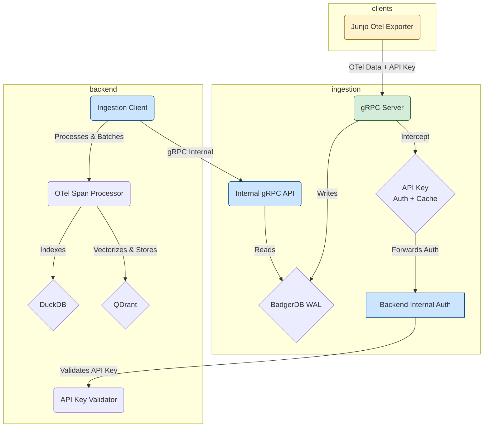
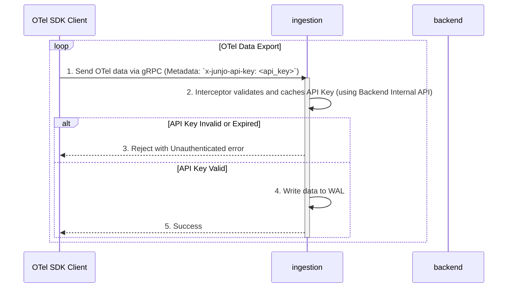
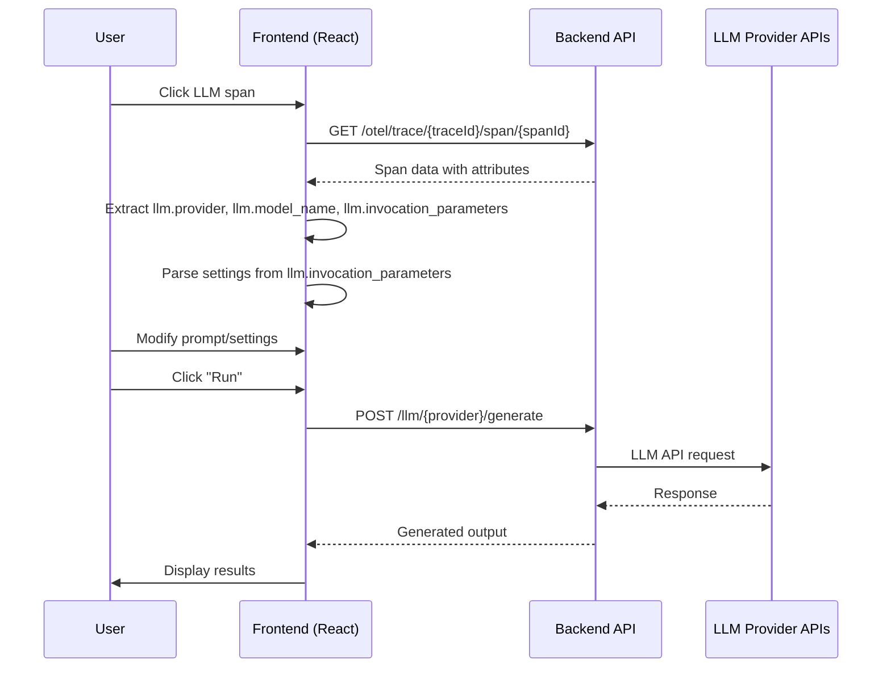

# Junjo AI Studio: System Architecture for LLM Agents

This document provides a high-level overview of the Junjo AI Studio architecture, designed to help LLM agents quickly understand the system's components and interaction flows.

## 1. System Overview

The Junjo AI Studio is a multi-service system designed for ingesting, storing, and analyzing OpenTelemetry (OTel) data. It consists of two primary backend services and client-side telemetry collection via the Junjo Otel Exporter.

*   **`backend`**: The main application server. It handles user authentication, provides the API and web UI, and processes telemetry data for analysis.
*   **`ingestion`**: A dedicated, high-throughput service responsible for receiving OTel data from clients and persisting it to a Write-Ahead Log (WAL).
*   **Junjo Otel Exporter**: A specialized OpenTelemetry exporter that sends telemetry data to the ingestion.

## 2. Component Architecture

The services are designed to be decoupled, with specific responsibilities to ensure scalability and resilience.



### `backend` Service

*   **Responsibilities**:
    *   Serves the main web UI and REST API on port `1323`.
    *   Manages user accounts and API keys.
    *   Provides an internal gRPC endpoint for validating API keys.
    *   Reads data from the `ingestion` to index it into a queryable database (DuckDB) and vector store (QDrant).
*   **Internal Authentication Endpoint**:
    *   `J[Backend Internal Auth]`: Private gRPC endpoint for validating API keys.
*   **Key Files**:
    *   `backend/app/main.py`: Main FastAPI application entry point
    *   `backend/app/grpc_server.py`: Internal gRPC server lifecycle management
    *   `backend/app/features/internal_auth/grpc_service.py`: InternalAuthService implementation

### `ingestion`

*   **Responsibilities**:
    *   Exposes a public gRPC server on port `50051` that serves as the single point of contact for clients.
    *   **Enforces Authentication**: Protects its OTel endpoints using an API key interceptor that validates and caches keys using the backend's internal auth endpoint.
    *   Persists all incoming data to a highly-performant Write-Ahead Log (WAL) using BadgerDB.
*   **Key Files**:
    *   [`ingestion/main.go`](ingestion/main.go): Main application entry point.
    *   [`ingestion/server/server.go`](ingestion/server/server.go): gRPC server setup.
    *   [`ingestion/server/api_key_interceptor.go`](ingestion/server/api_key_interceptor.go): The API key authentication and caching logic.
    *   [`ingestion/backend_client/auth_client.go`](ingestion/backend_client/auth_client.go): The client for the backend's internal API key validation service.

## 3. Authentication Flow (API Key-based)

Authentication is handled via direct API key validation with caching, facilitated by the `ingestion` to provide secure and efficient access to the OTel ingestion endpoint.



### Step-by-Step Process:

1.  **Direct API Key Transfer**: The client sends its API key in the metadata header `x-junjo-api-key` along with OTel data directly to the ingestion service's gRPC server.
2.  **Interceptor Processing**: The ingestion service's API key interceptor intercepts the request and first checks its local cache for the API key.
3.  **Cache Check**: If the API key is found in the cache and is not expired, the request proceeds to be written to the WAL.
4.  **Backend Validation**: If the API key is not in the cache or is expired, the ingestion service forwards the API key to the backend's internal authentication gRPC service for validation.
5.  **Validation Response**: The backend checks the API key against its database and returns the validation result.
6.  **Cache Update**: The ingestion service updates its cache with the validation result, including an expiration time.
7.  **Access Control**: If the API key is valid (either from cache or backend), the request is allowed to proceed and the OTel data is written to the WAL. Otherwise, it is rejected with an `Unauthenticated` error.

## 3.1. Python Backend Internal Authentication gRPC Service

The Python backend (`backend`) now provides an **internal gRPC server** running concurrently with its FastAPI REST API. This gRPC service handles API key validation requests from the `ingestion`.

### Architecture Overview

The Python backend runs **two servers concurrently** in the same process:
1. **FastAPI REST API** on port `1324` (public-facing)
2. **gRPC server** on port `50053` (internal-only)

Both servers share the same SQLite database connection pool and run asynchronously using Python's `asyncio`.

### Concurrent Server Implementation

**Key Files:**
- `backend/app/main.py`: Orchestrates both servers using asyncio lifespan
- `backend/app/grpc_server.py`: gRPC server lifecycle management
- `backend/app/features/internal_auth/grpc_service.py`: InternalAuthService implementation
- `backend/app/database/api_keys/repository.py`: API key database operations

**Startup Flow:**
```python
# main.py - Lifespan context manager
@asynccontextmanager
async def lifespan(app: FastAPI):
    # Startup: Start gRPC server as background task
    grpc_task = asyncio.create_task(start_grpc_server_background())
    yield
    # Shutdown: Stop gRPC server gracefully
    await stop_grpc_server()
```

**Port Configuration:**
- Default gRPC port: `50053` (configured via `GRPC_PORT` environment variable)
- **Security Note**: This port should ONLY be accessible on the internal Docker network in production
- In docker-compose.yml, port 50053 is intentionally NOT exposed to the host

### gRPC Service Implementation

**Proto Definition:**
The service uses the shared `proto/auth.proto` definition:

```protobuf
service InternalAuthService {
  rpc ValidateApiKey(ValidateApiKeyRequest) returns (ValidateApiKeyResponse) {}
}

message ValidateApiKeyRequest {
  string api_key = 1;
}

message ValidateApiKeyResponse {
  bool is_valid = 1;
}
```

**Handler Logic** (`app/features/internal_auth/grpc_service.py`):
```python
class InternalAuthServicer(auth_pb2_grpc.InternalAuthServiceServicer):
    async def ValidateApiKey(
        self,
        request: auth_pb2.ValidateApiKeyRequest,
        context: grpc.aio.ServicerContext,
    ) -> auth_pb2.ValidateApiKeyResponse:
        api_key = request.api_key

        # Query database for API key
        result = await APIKeyRepository.get_by_key(api_key)

        if result is None:
            return auth_pb2.ValidateApiKeyResponse(is_valid=False)

        return auth_pb2.ValidateApiKeyResponse(is_valid=True)
```

**Key Features:**
- **Fail-closed security**: Returns `is_valid=False` on any error (database errors, exceptions)
- **Async database access**: Uses SQLAlchemy async sessions with proper isolation
- **No caching**: Caching is handled by the ingestion service
- **Structured logging**: Logs validation attempts with truncated key prefixes for security

### Database Access Pattern

The gRPC service uses the **high-concurrency async pattern** documented in `backend/app/database/README.md`:

```python
# Each validation creates its own database session
async with db_config.async_session() as session:
    stmt = select(APIKeyTable).where(APIKeyTable.key == key)
    result = await session.execute(stmt)
    db_obj = result.scalar_one_or_none()
```

This pattern ensures:
- Complete isolation between concurrent requests
- No session sharing between gRPC and FastAPI
- Thread-safe operation under high concurrency

### Integration with Ingestion Service

The `ingestion` connects to the Python backend's gRPC service:

**Docker Compose Configuration:**
```yaml
junjo-ai-studio-ingestion:
  environment:
    - BACKEND_GRPC_HOST=junjo-ai-studio-backend
    - BACKEND_GRPC_PORT=50053
  depends_on:
    junjo-ai-studio-backend:
      condition: service_healthy
```

**Connection Flow:**
1. Ingestion service receives OTel data with `x-junjo-api-key` header
2. API key interceptor checks local cache
3. On cache miss, calls Python backend gRPC: `ValidateApiKey(api_key)`
4. Python backend queries SQLite database
5. Returns `is_valid` response
6. Ingestion service updates cache with result

### Testing

**Unit Tests** (`app/features/internal_auth/test_grpc_service.py`):
- Mock APIKeyRepository to test logic without database
- Test valid keys, invalid keys, empty keys, database errors

**Integration Tests** (`app/features/internal_auth/test_grpc_integration.py`):
- Connect to real gRPC server on port 50053
- Test with actual API keys from database
- Verify server connectivity and response format

**Concurrent Access Tests** (`app/features/internal_auth/test_concurrent_access.py`):
- 50+ concurrent gRPC requests
- Mixed FastAPI + gRPC traffic
- Database isolation under load
- Verify no race conditions

## 4. Data Flow: WAL and Indexing

The `ingestion` acts as a Write-Ahead Log (WAL) for the main `backend`. This decouples the high-throughput ingestion of OTel data from the more resource-intensive process of indexing that data for querying.

### Step-by-Step Process:

1.  **Write to WAL**: The `ingestion` receives OTel data via its public gRPC endpoint and immediately writes the raw, serialized data to a BadgerDB WAL. This is a fast, append-only operation.

2.  **Internal Read API**: The `ingestion` exposes a second, internal-only gRPC service (`WALReaderService`) that allows the `backend` to read data from the WAL in batches.

3.  **Client Polling**: The `backend`'s `ingestion_client` periodically polls the `WALReaderService`, requesting a batch of spans starting from the last key it successfully processed.

4.  **State Management**: The `backend` is responsible for persisting the key of the last span it indexed. This ensures that if the `backend` restarts, it can resume processing from where it left off without missing any data.

5.  **Processing and Indexing**: Once the `backend` receives a batch of spans, it uses its `otel_span_processor` to deserialize, process, and index the data into a DuckDB database and vector store (QDrant), making it available for querying via the main API.

This pull-based architecture makes the system resilient. The `ingestion` can continue to accept data even if the `backend` is temporarily down or slow to index.

## 5. OpenInference Semantic Conventions

Junjo AI Studio uses **OpenInference** semantic conventions for LLM observability. OpenInference is a standardized format for capturing LLM-related telemetry data within OpenTelemetry spans.

### Key OpenInference Attributes

The system expects and utilizes the following OpenInference attributes on LLM spans:

*   **`llm.provider`**: The LLM provider (e.g., `"openai"`, `"anthropic"`, `"google"`)
    *   **Note**: OpenInference uses `"google"` for Gemini, but internally Junjo maps this to `"gemini"`
*   **`llm.model_name`**: The specific model identifier (e.g., `"gpt-4o"`, `"claude-3-5-sonnet-20241022"`, `"gemini-2.0-flash-exp"`)
*   **`llm.invocation_parameters`**: A JSON string containing all request parameters used during the LLM invocation
    *   Example: `'{"temperature": 0.7, "max_tokens": 2048, "reasoning_effort": "medium"}'`
    *   This is the **primary source** for generation settings in the Prompt Playground
*   **`input.mime_type`**: The MIME type of the input (e.g., `"application/json"` indicates structured output was used)
*   **`output.mime_type`**: The MIME type of the output
*   **`input.value`**: The actual prompt text sent to the LLM
*   **`output.value`**: The generated response from the LLM

### Provider Mapping

The system includes utilities for mapping between OpenInference provider names and internal representations:

*   **Frontend**: `frontend/src/features/prompt-playground/utils/provider-mapping.ts`

Current mappings:
*   `"google"` (OpenInference) → `"gemini"` (Junjo internal)
*   `"openai"` → `"openai"` (no mapping needed)
*   `"anthropic"` → `"anthropic"` (no mapping needed)

## 6. Prompt Playground Architecture

The Prompt Playground is a feature that allows users to replay, modify, and experiment with LLM requests captured from their applications.

### Core Concept

When a user clicks on an LLM span in the trace viewer, they can open the Prompt Playground to:
1. See the original prompt and model configuration
2. Modify the prompt and settings
3. Re-run the request against the same or different models/providers
4. Compare outputs

### Data Flow



### Provider-Specific Endpoints

The backend provides separate REST endpoints for each LLM provider:

*   **OpenAI**: `POST /llm/openai/generate`
*   **Anthropic**: `POST /llm/anthropic/generate`
*   **Gemini**: `POST /llm/gemini/generate`

Each handler:
1. Validates the request using Pydantic models
2. Retrieves the API key from environment variables
3. Forwards the request to the provider's API
4. Returns the response (or error) to the frontend

### Frontend Architecture

**Main Component**: `frontend/src/features/prompt-playground/PromptPlaygroundPage.tsx`

**Key State Management**:
*   Uses Redux Toolkit for state: `frontend/src/features/prompt-playground/store/slice.ts`
*   State includes:
    *   `selectedModel`: Currently selected model
    *   `selectedProvider`: Currently selected provider
    *   `jsonMode`: Whether the Structured Output toggle is enabled (internal variable name)
    *   `generationSettings`: Provider-specific generation parameters

**Request Schemas**: `frontend/src/features/prompt-playground/schemas/`
*   `openai-request.ts`: Zod schemas for OpenAI requests/responses
*   `anthropic-request.ts`: Zod schemas for Anthropic requests/responses
*   `gemini-request.ts`: Zod schemas for Gemini requests/responses

### Generation Settings

The Prompt Playground supports provider-specific and model-specific generation settings:

#### Settings Import from OpenInference

When a span is loaded, settings are imported from `llm.invocation_parameters`:

```typescript
// Example llm.invocation_parameters value:
{
  "temperature": 0.7,
  "max_completion_tokens": 4096,
  "reasoning_effort": "medium"  // OpenAI reasoning models only
}
```

The frontend parses this JSON and populates the settings UI.

#### Provider-Specific Settings

**OpenAI**:
*   `reasoning_effort`: `"minimal" | "low" | "medium" | "high"` (reasoning models only: o1, o3, o4, gpt-5, but NOT o1-mini)
*   `max_completion_tokens`: Number (all models)
*   `temperature`: Number 0-2 (non-reasoning models only)

**Anthropic**:
*   `thinking_enabled`: Boolean (enables extended thinking)
*   `thinking_budget_tokens`: Number ≥1024 (requires thinking_enabled)
*   `temperature`: Number 0-1
*   `max_tokens`: Number (required by API)

**Gemini**:
*   `thinkingBudget`: Number (-1 = dynamic, 0 = disabled, 1-32768 = specific budget)
    *   **Important**: This must be nested in `generationConfig.thinkingConfig.thinkingBudget`
    *   Only supported on Gemini 2.5 series models (2.5-pro, 2.5-flash, 2.5-flash-lite)
*   `includeThoughts`: Boolean (includes thought summaries in response)
    *   **Important**: This must be nested in `generationConfig.thinkingConfig.includeThoughts`
*   `temperature`: Number 0-2
*   `maxOutputTokens`: Number

Example Gemini request structure with thinking:
```json
{
  "model": "gemini-2.5-flash",
  "contents": [...],
  "generationConfig": {
    "temperature": 0.7,
    "maxOutputTokens": 2048,
    "thinkingConfig": {
      "thinkingBudget": 1024,
      "includeThoughts": true
    }
  }
}
```

### Structured Output Toggle

The Prompt Playground provides a **Structured Output** toggle that enables JSON output from LLM requests. When enabled, the application intelligently chooses the best approach based on telemetry data:

#### Toggle Behavior Logic

The Structured Output toggle controls whether JSON output is requested from the LLM. The specific implementation depends on whether a JSON schema was detected from the original request's OpenInference telemetry:

| Structured Output Toggle | Schema Detected from Telemetry? | Request Behavior |
|--------------------------|----------------------------------|------------------|
| ✅ **Enabled** | ✅ **Yes** | **Structured Outputs** (schema-based)<br/>Schema-constrained JSON that adheres to the detected schema |
| ✅ **Enabled** | ❌ **No** | **Schema-less JSON Mode**<br/>Unconstrained JSON output without schema validation |
| ❌ **Disabled** | ✅ Yes | **Normal text mode**<br/>Schema is ignored, even if detected |
| ❌ **Disabled** | ❌ No | **Normal text mode**<br/>Standard text response |

**Key Points**:
- When a schema is detected from telemetry and the toggle is enabled, the application uses **modern Structured Outputs** (the preferred approach)
- When no schema is available but JSON output is desired, the application falls back to **schema-less JSON mode** for experimentation
- The schema is **only sent** when the toggle is enabled AND a schema is detected
- Disabling the toggle always results in normal text mode, regardless of schema availability

#### Structured Outputs vs Schema-less JSON Mode

| Feature | Structured Outputs (with schema) | Schema-less JSON Mode |
|---------|----------------------------------|----------------------|
| Outputs valid JSON | ✅ Yes | ✅ Yes |
| Adheres to schema | ✅ Yes (guaranteed) | ❌ No (best effort) |
| Schema required | ✅ Yes (from telemetry) | ❌ No |
| **OpenAI Implementation** | `response_format: { type: "json_schema", json_schema: {...} }` | `response_format: { type: "json_object" }` |
| **Anthropic Implementation** | `tools: [{ input_schema: {...} }], tool_choice: {...}` | Generic tool with flexible schema |
| **Gemini Implementation** | `response_json_schema: {...}` | `responseMimeType: "application/json"` only |
| **When Used** | Schema detected from original request | No schema available, user wants JSON |
| **Reliability** | High (schema enforced) | Medium (LLM does its best) |

#### Detection from OpenInference Telemetry

**Detection Utilities**: `frontend/src/features/prompt-playground/utils/provider-warnings.ts`

All providers store JSON schemas in the `llm.invocation_parameters` attribute, but in different locations and formats:

**OpenAI Schema Detection**:
```typescript
// Location: llm.invocation_parameters.response_format.json_schema.schema
{
  "response_format": {
    "type": "json_schema",
    "json_schema": {
      "name": "person_schema",
      "strict": true,
      "schema": {  // ← Extracted schema
        "type": "object",
        "properties": {
          "name": { "type": "string" },
          "age": { "type": "number" }
        },
        "required": ["name", "age"]
      }
    }
  }
}
```

**Anthropic Schema Detection**:
```typescript
// Location: llm.invocation_parameters.tools[0].input_schema
{
  "tools": [
    {
      "name": "structured_output",
      "description": "Return data in structured JSON format",
      "input_schema": {  // ← Extracted schema
        "type": "object",
        "properties": {
          "summary": { "type": "string" },
          "topics": { "type": "array", "items": { "type": "string" } }
        },
        "required": ["summary"]
      }
    }
  ],
  "tool_choice": { "type": "tool", "name": "structured_output" }
}
```

**Gemini Schema Detection**:
```typescript
// Location: llm.invocation_parameters.response_json_schema
{
  "response_json_schema": {  // ← Extracted schema
    "type": "object",  // Note: JSON Schema format (lowercase) - same as OpenAI/Anthropic
    "properties": {
      "title": { "type": "string", "description": "The title of the article" },
      "content": { "type": "string", "description": "The main content" },
      "tags": { "type": "array", "items": { "type": "string" } },
      "published": { "type": "boolean" }
    },
    "required": ["title", "content"]
  }
}
```

**Unified Detection Function**:
```typescript
// Returns the schema if found, null otherwise
const jsonSchema = detectJsonSchema(span)  // Tries all provider detectors
```

**Important Notes:**
- **`response_json_schema`** (snake_case) is the proper telemetry attribute for modern Gemini structured outputs
- Uses JSON Schema format (lowercase types), fully compatible with OpenAI and Anthropic
- The genai Python library captures this when using the `response_schema` parameter with Pydantic models
- The legacy `responseSchema` (camelCase) used OpenAPI 3.0 format and is deprecated

#### Schema Forwarding to Provider APIs

When the Structured Output toggle is enabled, schemas are extracted **on-demand** in `PromptPlaygroundPage.tsx` during `handleSubmit()`:

```typescript
const handleSubmit = async (event: React.FormEvent<HTMLFormElement>) => {
  // Extract schema on-demand from span (no Redux state)
  const jsonSchema = span ? detectJsonSchema(span) : null

  // jsonMode variable tracks the Structured Output toggle state
  // Schema is only used if toggle is enabled (jsonMode === true)
}
```

**OpenAI**:
```typescript
await openaiRequest({
  model: selectedModel,
  messages: [{ role: 'user', content: prompt }],
  // Structured output with JSON schema (when schema detected)
  ...(jsonMode && jsonSchema && {
    response_format: {
      type: 'json_schema',
      json_schema: {
        name: 'structured_output',
        strict: true,
        schema: jsonSchema  // ← Forwarded schema
      }
    }
  }),
  // Schema-less JSON mode (when no schema detected)
  ...(jsonMode && !jsonSchema && {
    response_format: { type: 'json_object' }
  }),
})
```

**Anthropic**:
```typescript
await anthropicRequest({
  model: selectedModel,
  messages: [{ role: 'user', content: prompt }],
  max_tokens: generationSettings.max_tokens || 4096,
  // Structured output via tools with JSON schema (when schema detected)
  ...(jsonMode && jsonSchema && {
    tools: [{
      name: 'structured_output',
      description: 'Return data in structured JSON format',
      input_schema: jsonSchema  // ← Forwarded schema
    }],
    tool_choice: { type: 'tool', name: 'structured_output' }
  }),
  // Schema-less JSON mode (when no schema detected)
  ...(jsonMode && !jsonSchema && {
    jsonMode: true  // Backend handles generic tool setup
  }),
})
```

**Gemini**:
```typescript
await geminiRequest({
  model: selectedModel,
  contents: [{ parts: [{ text: prompt }] }],
  generationConfig: {
    // Structured output with JSON schema (when schema detected)
    ...(jsonMode && jsonSchema && {
      responseMimeType: 'application/json',
      response_json_schema: jsonSchema  // ← Forwarded schema
    }),
    // Schema-less JSON mode (when no schema detected)
    ...(jsonMode && !jsonSchema && {
      responseMimeType: 'application/json'
    }),
  }
})
```

#### Schema Format Compatibility

**Good News**: All three providers now use JSON Schema format for structured outputs!

**Gemini Structured Output Approaches:**

1. **`response_json_schema`** (RECOMMENDED - Modern approach):
   - Uses JSON Schema format (lowercase: `"string"`, `"object"`, `"number"`)
   - Same format as OpenAI and Anthropic
   - Directly compatible across providers
   - Documentation: https://ai.google.dev/gemini-api/docs/structured-output#json-schemas

2. **`responseSchema`** (LEGACY - Deprecated):
   - Used OpenAPI 3.0 format (uppercase: `"STRING"`, `"OBJECT"`, `"NUMBER"`)
   - Incompatible with OpenAI/Anthropic schemas
   - Not recommended for new implementations

**Current Behavior**: Schemas detected from telemetry using `response_json_schema` are fully compatible across all three providers (OpenAI, Anthropic, Gemini) and can be forwarded as-is.

**Legacy Compatibility**: If old telemetry contains `responseSchema` with OpenAPI 3.0 format, schema conversion would be needed for cross-provider compatibility. However, new implementations should use `response_json_schema`.

#### UI Indicators

**Structured Output Toggle** (`frontend/src/features/prompt-playground/PromptPlaygroundPage.tsx`):
- Located in the playground controls area
- Label: "Structured Output"
- When enabled with schema detected: Uses schema-based structured outputs
- When enabled without schema: Uses schema-less JSON mode with warning message

**JsonSchemaBanner** (`frontend/src/features/prompt-playground/components/JsonSchemaBanner.tsx`):
- Displays when a schema is detected from telemetry
- Message: "JSON Schema detected and active - Playground requests will use this schema for structured output"
- Clickable to view full schema details in modal
- Only shows when schema is available (independent of toggle state)

**Schema-less Mode Warning**:
- Displays when Structured Output toggle is enabled but no schema is detected
- Message: "Note: No JSON schema detected from the original request. Using schema-less JSON mode. If the original request used a typed schema, results may differ."

**ActiveSettingsDisplay** (`frontend/src/features/prompt-playground/components/ActiveSettingsDisplay.tsx`):
- Shows `json_schema: active` indicator when both:
  - Structured Output toggle is enabled AND
  - A schema is detected from telemetry
- Displayed alongside other active generation settings

#### Testing

**Frontend Tests**: `frontend/src/features/prompt-playground/utils/provider-warnings.test.ts`
- Mock OpenInference spans with realistic schemas for all three providers
- Tests schema detection, edge cases, and robustness
- 18 tests covering all providers and error conditions

Run tests:
```bash
# Frontend
cd frontend && npm run test:run
```

### Model Capability Detection

Different models support different parameters. The playground uses pattern matching to determine capabilities:

**OpenAI Reasoning Models**: `/^(o1-(?!mini)|o3-|o4-|gpt-5)/`
*   Supports: `reasoning_effort`, `max_completion_tokens`
*   Does NOT support: `temperature`
*   Note: `o1-mini` is excluded as it doesn't support `reasoning_effort`

**Gemini Thinking Models**: `/^gemini-2\.5-/`
*   Only 2.5 series supports thinking
*   2.0, 1.5, and earlier do NOT support thinking

**Anthropic Extended Thinking Models**: Claude Sonnet 4.x/3.7, Haiku 4.x, Opus 4.x
*   Older models like `claude-3-5-sonnet` do NOT support extended thinking

### Settings Reset Behavior

**Critical Implementation Detail**: The playground follows a "reset on change" pattern:

1. When the user changes the selected model or provider, ALL settings are reset to `{}`
2. Settings are then re-imported from `llm.invocation_parameters` if available
3. No attempt is made to preserve or migrate settings between model selections

This is implemented in `PromptPlaygroundPage.tsx` using a `useEffect` that watches `selectedModel` and `selectedProvider`.

### UI Components

**GenerationSettingsModal** (`frontend/src/features/prompt-playground/components/GenerationSettingsModal.tsx`):
*   Provider-specific sections with conditional rendering
*   Model detection to hide incompatible settings
*   Plain HTML form elements styled with Tailwind CSS

**ActiveSettingsDisplay** (`frontend/src/features/prompt-playground/components/ActiveSettingsDisplay.tsx`):
*   Shows active (non-default) settings as compact key-value pairs
*   Displayed between the prompt textarea and provider/model selectors

### Future Enhancement: OpenTelemetry Instrumentation

Currently, the playground endpoints (`/llm/{provider}/generate`) do NOT emit OpenTelemetry spans. Future work (documented in `PHASE4_OPENTELEMETRY_INSTRUMENTATION.md`) will add:
*   Span creation for each playground request
*   `llm.invocation_parameters` attribute with all request settings
*   Token usage metrics
*   Error tracking

This will allow playground usage to be captured and analyzed like production LLM calls.

## 7. Proto File Generation & Build Process

Junjo AI Studio uses Protocol Buffers for internal gRPC communication between services. The proto files define the API contracts for authentication and span ingestion between `backend` and `ingestion`.

### Proto File Locations

**Source Proto Files** (`proto/` directory at repository root):
- `proto/auth.proto` - Internal authentication service for API key validation
- `proto/ingestion.proto` - Internal ingestion service for reading spans from WAL

**Generated Proto Files**:
- **Backend (Python)**: `backend/app/proto_gen/`
  - `auth_pb2.py`, `auth_pb2_grpc.py`
  - `ingestion_pb2.py`, `ingestion_pb2_grpc.py`
  - `__init__.py`
- **Ingestion Service (Go)**: `ingestion/proto_gen/`
  - `auth.pb.go`, `auth_grpc.pb.go`
  - `ingestion.pb.go`, `ingestion_grpc.pb.go`

### Defense in Depth Strategy

Proto files are generated using a **multi-layered approach** to ensure they are always fresh:

1. **Pre-commit Hooks** - Auto-generate and stage proto files before each commit (local convenience)
2. **GitHub Actions Validation** - Validates proto files on CI, fails build if stale (enforcement - cannot be bypassed)
3. **Docker Build Generation** - Regenerate during Docker image build (production safety)
4. **Git Commit** - Proto files are committed to enable local testing without protoc

This approach provides **four layers of protection** against stale proto code in production, with GitHub Actions providing true enforcement that pre-commit hooks alone cannot provide.

### Generation Methods

#### Manual Generation (Development)

**Go (ingestion)**:
```bash
cd ingestion
make proto
```

**Python (backend)**:
```bash
cd backend
./scripts/generate_proto.sh
```

#### Automatic Generation (Pre-commit Hook)

The pre-commit hook automatically regenerates proto files before each commit:

**Install hook**:
```bash
./scripts/install-git-hooks.sh
```

**What it does**:
- Runs `make proto` for ingestion
- Runs `generate_proto.sh` for backend
- Stages any modified proto files automatically
- Prevents commits with stale proto code

**Hook script**: `scripts/pre-commit.sh`

#### Docker Build Generation

Both services regenerate proto files during Docker builds as a safety mechanism:

**Ingestion Service** (`ingestion/Dockerfile`):
```dockerfile
# Install protoc and Go plugins
RUN apk add --no-cache protobuf protobuf-dev && \
    go install google.golang.org/protobuf/cmd/protoc-gen-go@latest && \
    go install google.golang.org/grpc/cmd/protoc-gen-go-grpc@latest

# Generate proto files
RUN protoc \
    -I../proto \
    --go_out=./proto_gen \
    --go-grpc_out=./proto_gen \
    ../proto/*.proto
```

**Backend** (`backend/Dockerfile`):
```dockerfile
# Generate proto files using unified script
RUN chmod +x /tmp/generate_proto.sh && \
    /tmp/generate_proto.sh /app/app/proto_gen /app/../proto
```

#### GitHub Actions Validation (CI Enforcement)

A GitHub Actions workflow validates proto files on every push and pull request:

**Workflow**: `.github/workflows/validate-proto.yml`

**What it does**:
1. Installs protoc and all required plugins
2. Regenerates proto files from scratch
3. Runs `git diff` to check for changes
4. **Fails the build** if proto files are out of date
5. Provides clear instructions for fixing the issue

**When it runs**:
- On every pull request
- On pushes to main/master branches
- Can be made a required status check for PR merging

**Why this matters**:
- Pre-commit hooks can be bypassed with `git commit --no-verify`
- GitHub Actions provides **true enforcement** that cannot be bypassed
- Catches stale proto files before they reach the main branch
- Works for all contributors without local setup

This provides an additional layer of defense that pre-commit hooks alone cannot provide.

### Why Proto Files Are Committed

Proto files are committed to git (not ignored) for these reasons:

1. **Local Testing** - Developers can test immediately without installing protoc
2. **Integration Tests** - CI/CD can run tests without proto generation step
3. **Consistency** - Matches pattern used in Junjo client SDK
4. **Pre-commit Safety** - Hook ensures they stay fresh

### Published Docker Images

When Docker images are published via GitHub Actions:

1. GitHub Actions checks out the repository
2. Docker builds each service from its Dockerfile
3. **Proto files are regenerated during Docker build** (defense in depth)
4. Published images are guaranteed to have fresh proto code

Even if the pre-commit hook somehow failed, Docker build generation ensures correctness.

### Troubleshooting

**Pre-commit hook fails**:
- Check that `protoc` is installed: `protoc --version`
- Check that Go plugins are installed: `which protoc-gen-go protoc-gen-go-grpc`
- Install with: `go install google.golang.org/protobuf/cmd/protoc-gen-go@latest && go install google.golang.org/grpc/cmd/protoc-gen-go-grpc@latest`

**Python proto generation fails**:
- Ensure `grpcio-tools` is installed: `pip install grpcio-tools` or `uv sync`
- Check script exists: `backend/scripts/generate_proto.sh`

**Proto import errors in code**:
- Regenerate manually: `cd backend && ./scripts/generate_proto.sh`
- Check files exist in `backend/app/proto_gen/` and `ingestion/proto_gen/`

# Code Organization & Principles

This section documents the code organization conventions and architectural principles for the Junjo AI Studio codebase. These guidelines help maintain consistency, enable feature-based development, and make the codebase accessible to both LLM agents and human developers.

## Core Principles

### Feature-Based Separation

The codebase follows **feature-based organization** as the primary structural pattern. The guiding principle is: "You should be able to delete a feature by deleting its folder."

This is a rule of thumb, not an absolute requirement. For functions, utilities, and components that need to be shared across multiple features, use a `common/` or `shared/` folder.

### Layered Separation of Concerns

Within each feature, code is organized by **layer** (handler, service, repository, etc.) with each layer having a **single responsibility**.

### Single Responsibility Principle

Each file, function, and module should have one clear purpose. This makes code easier to understand, test, and modify.

### Import Organization

All imports must be placed at the top of the file, immediately after the module docstring (if present).

**Structure (all languages):**
1. Module/file docstring (if any)
2. Standard library imports
3. Third-party library imports
4. Local application imports

**Python:**
```python
"""Module docstring describing the file's purpose."""

# Standard library
import asyncio
import os
from typing import Optional

# Third-party
from fastapi import APIRouter, Depends
from loguru import logger

# Local
from app.config.settings import settings
from app.features.auth.dependencies import CurrentUserEmail

# Code starts here
router = APIRouter()
```

**TypeScript:**
```typescript
/**
 * Module docstring describing the file's purpose.
 */

// React/external libraries
import React, { useState } from 'react'
import { z } from 'zod'

// Internal imports
import { fetchAPIKeys } from './fetch/get-api-keys'
import { useAppSelector } from '@/hooks/redux'

// Code starts here
export function Component() { ... }
```

**Rationale:**
- Provides immediate visibility of dependencies
- Makes circular dependency issues obvious
- Follows language community conventions
- Enables static analysis tools to work effectively
- Improves code readability

**Exceptions:**
- Lazy imports for performance (rare, must be documented)
- Conditional imports in dynamic scenarios (must be justified)

## Frontend (React/TypeScript) Organization

The frontend is built with React, TypeScript, Redux Toolkit, and Vite.

### Feature Structure

```
frontend/src/features/
  feature-name/
    components/              # React components
      FeatureComponent.tsx
      SubComponent.tsx
    hooks/                   # Custom React hooks (or hooks.ts for small features)
    schemas/                 # Zod schemas (or schemas.ts for small features)
      request-schema.ts
      response-schema.ts
    utils/                   # Utility functions (or utils.ts for small features)
      helper.ts
    store/                   # Redux state management
      slice.ts               # Redux Toolkit slice
      selectors.ts
      listener.ts            # Listener middleware
    fetch/                   # API fetch functions
      get-something.ts       # Single responsibility fetch
      post-something.ts
    constants.ts             # Feature-specific constants
    FeaturePage.tsx          # Main feature page component
```

### File vs Folder Pattern

**Rule:** Start with single files for small concerns. Split into folders when they grow.

Examples:
- Small feature: `schemas.ts` (single file)
- Large feature: `schemas/` (folder with multiple files)
- Same for `utils.ts` vs `utils/`, `hooks.ts` vs `hooks/`, etc.

### Layer Responsibilities

#### components/

React components specific to this feature.

**Component props:** Define TypeScript types co-located with the component:
```typescript
// components/FeatureCard.tsx
interface FeatureCardProps {
  title: string
  description: string
  onSelect: () => void
}

export function FeatureCard({ title, description, onSelect }: FeatureCardProps) {
  // ...
}
```

##### Component Size Guidelines

Components should be focused and manageable in size.

**Size thresholds:**
- **< 200 lines**: Ideal size for most components
- **200-400 lines**: Acceptable, but watch for growing complexity
- **400-600 lines**: Warning - consider refactoring
- **> 600 lines**: Must refactor - component has too many responsibilities

**When to break up a component:**
- Component has more than 3 distinct responsibilities
- You need significant scrolling to understand what it does
- Tests are difficult to write due to complexity
- Multiple unrelated pieces of state or logic

**Refactoring approaches:**
1. **Extract sub-components** for distinct UI sections
2. **Extract custom hooks** for complex state logic
3. **Extract request builders** or business logic to utils/
4. **Use composition** instead of large conditional rendering

Example:
```typescript
// ❌ Too large - 683 lines, multiple concerns
export function PromptPlaygroundPage() {
  // Schema detection logic
  // Request building for 3 providers
  // Form handling
  // Settings modal state
  // Response display
  // Error handling
  return (
    <div>
      {/* 600+ lines of JSX */}
    </div>
  )
}

// ✅ Refactored - focused components
export function PromptPlaygroundPage() {
  return (
    <div>
      <SchemaDetectionBanner />
      <PromptInput />
      <ProviderModelSelector />
      <StructuredOutputToggle />
      <RequestSubmitter />
      <ResponseDisplay />
    </div>
  )
}
```

##### Component Props and Re-render Optimization

**Principle:** Components should receive minimal primitives needed to render, not large chunks of state.

**Why:** Reduces unnecessary re-renders and makes components more reusable and testable.

**Anti-pattern:**
```typescript
// ❌ Passing entire objects from state
interface UserCardProps {
  user: User  // Large object with many fields
  settings: AppSettings  // Another large object
}

function UserCard({ user, settings }: UserCardProps) {
  return <div>{user.name}</div>  // Only uses one field
}

// Component re-renders whenever ANY field in user or settings changes
```

**Better pattern:**
```typescript
// ✅ Pass only primitives needed
interface UserCardProps {
  userId: string
  userName: string
  onSelect: (id: string) => void
}

function UserCard({ userId, userName, onSelect }: UserCardProps) {
  return (
    <div onClick={() => onSelect(userId)}>
      {userName}
    </div>
  )
}

// Component only re-renders when userId or userName actually changes
```

**Optimal pattern with selectors:**
```typescript
// ✅ Pass ID, use selector inside component
interface UserCardProps {
  userId: string
  onSelect: (id: string) => void
}

function UserCard({ userId, onSelect }: UserCardProps) {
  // Component retrieves only the data it needs from the store
  const userName = useAppSelector(state => selectUserNameById(state, userId))
  const userAvatar = useAppSelector(state => selectUserAvatarById(state, userId))

  return (
    <div onClick={() => onSelect(userId)}>
      
      {userName}
    </div>
  )
}

// Component only re-renders when the specific fields it selects change
```

**Guidelines:**
1. **Pass IDs, not objects** when the component needs to look up data
2. **Use memoized selectors** to select specific fields from state
3. **Pass primitive values** (strings, numbers, booleans) when possible
4. **Pass callbacks** instead of dispatch functions to keep components decoupled
5. **Avoid passing entire Redux state slices** to components

**Example with Redux:**
```typescript
// ❌ Anti-pattern
function TraceList() {
  const traces = useAppSelector(state => state.traces)  // Entire slice
  return traces.items.map(trace => <TraceCard trace={trace} />)  // Passing entire object
}

// ✅ Better
function TraceList() {
  const traceIds = useAppSelector(selectTraceIds)  // Just IDs
  return traceIds.map(id => <TraceCard traceId={id} />)  // Pass ID only
}

function TraceCard({ traceId }: { traceId: string }) {
  const traceName = useAppSelector(state => selectTraceNameById(state, traceId))
  const traceStatus = useAppSelector(state => selectTraceStatusById(state, traceId))
  // Component only subscribes to specific fields it needs
  return <div>{traceName} - {traceStatus}</div>
}
```

#### hooks/

Custom React hooks for this feature.

Examples:
- `useFeatureData.ts`
- `useFeatureForm.ts`

#### schemas/

**Zod schemas** for data that requires validation (API requests/responses).

**TypeScript types** for data that doesn't require runtime validation.

Example:
```typescript
// schemas/create-request.ts
import { z } from 'zod'

export const createRequestSchema = z.object({
  name: z.string().min(1),
  email: z.string().email(),
})

export type CreateRequest = z.infer<typeof createRequestSchema>
```

##### Type Consistency Guidelines

**Principle:** Related functions operating on the same domain concept should return consistent types.

**Why:** Inconsistent return types create confusion, require unnecessary type conversions, and make code harder to maintain.

**Anti-pattern:**
```typescript
// ❌ Inconsistent return types for same concept
export interface JsonSchemaInfo {
  provider: string
  schema: Record<string, any>
}

// Provider-specific detectors return full info
export function detectOpenAISchema(span: OtelSpan): JsonSchemaInfo | null {
  // Returns { provider: 'openai', schema: {...} }
}

// But unified detector returns just the schema
export function detectJsonSchema(span: OtelSpan): Record<string, any> | null {
  // Returns just {...} (the schema)
}

// Forces consumers to handle inconsistency:
const openaiResult = detectOpenAISchema(span)
const schema1 = openaiResult?.schema  // Need to extract schema

const schema2 = detectJsonSchema(span)  // Already just the schema
```

**Better pattern:**
```typescript
// ✅ Consistent return types
export interface JsonSchemaInfo {
  provider: string
  schema: Record<string, any>
}

// All detectors return the same shape
export function detectOpenAISchema(span: OtelSpan): JsonSchemaInfo | null {
  return { provider: 'openai', schema: {...} }
}

export function detectAnthropicSchema(span: OtelSpan): JsonSchemaInfo | null {
  return { provider: 'anthropic', schema: {...} }
}

export function detectJsonSchema(span: OtelSpan): JsonSchemaInfo | null {
  return detectOpenAISchema(span)
    || detectAnthropicSchema(span)
    || detectGeminiSchema(span)
}

// Consumers use the same pattern for all:
const result = detectJsonSchema(span)
if (result) {
  console.log(result.provider, result.schema)
}
```

**Guidelines:**
1. **Same domain concept → same return type structure**
2. **Don't force consumers to remember which variant returns what**
3. **If you need just part of the data, extract it at the call site**
4. **Document the reason if you must use different types**

**When different return types are acceptable:**
- Functions serve fundamentally different purposes (not just different scopes)
- One is an internal helper, the other is the public API
- The types represent genuinely different concepts

#### utils/

Utility functions specific to this feature.

Keep utilities focused on the feature's domain. For cross-feature utilities, use `frontend/src/common/utils/`.

##### Request Builders Pattern

When request construction involves complex conditional logic (especially provider-specific or schema-based logic), extract to dedicated request builder functions in `utils/`.

**Why:** Keeps components clean, makes request logic testable independently, and provides a single source of truth for request structure.

**Anti-pattern:**
```typescript
// ❌ Complex request logic embedded in component
export function PromptPlaygroundPage() {
  const handleSubmit = async () => {
    // 50+ lines of conditional request building
    const request = {
      model: selectedModel,
      messages: [{ role: 'user', content: prompt }],
      ...(jsonMode && jsonSchema && provider === 'openai' && {
        response_format: {
          type: 'json_schema',
          json_schema: {
            name: 'structured_output',
            strict: true,
            schema: jsonSchema
          }
        }
      }),
      ...(jsonMode && !jsonSchema && provider === 'openai' && {
        response_format: { type: 'json_object' }
      }),
      // ... 40 more lines for other providers
    }
    await fetch('/api/generate', { body: JSON.stringify(request) })
  }

  return <form onSubmit={handleSubmit}>...</form>
}
```

**Better pattern:**
```typescript
// ✅ utils/request-builders.ts
export function buildStructuredOutputRequest(
  provider: string,
  baseParams: { model: string; messages: Message[] },
  jsonSchema: Record<string, any> | null,
  jsonMode: boolean
) {
  switch (provider) {
    case 'openai':
      return buildOpenAIRequest(baseParams, jsonSchema, jsonMode)
    case 'anthropic':
      return buildAnthropicRequest(baseParams, jsonSchema, jsonMode)
    case 'google':
      return buildGeminiRequest(baseParams, jsonSchema, jsonMode)
    default:
      return baseParams
  }
}

function buildOpenAIRequest(
  params: BaseParams,
  schema: Record<string, any> | null,
  jsonMode: boolean
) {
  return {
    ...params,
    ...(jsonMode && schema && {
      response_format: {
        type: 'json_schema',
        json_schema: { name: 'structured_output', strict: true, schema }
      }
    }),
    ...(jsonMode && !schema && {
      response_format: { type: 'json_object' }
    })
  }
}

// Component stays clean
export function PromptPlaygroundPage() {
  const handleSubmit = async () => {
    const request = buildStructuredOutputRequest(
      selectedProvider,
      { model: selectedModel, messages: [{ role: 'user', content: prompt }] },
      jsonSchema,
      jsonMode
    )
    await fetch('/api/generate', { body: JSON.stringify(request) })
  }

  return <form onSubmit={handleSubmit}>...</form>
}
```

**Benefits:**
1. **Testability**: Request building logic can be unit tested independently
2. **Single Source of Truth**: One place to maintain request structure
3. **Reduced Component Complexity**: Component focuses on UI concerns
4. **Reusability**: Same builder can be used in multiple components

**When to use:**
- Request construction involves more than simple object spread
- Provider-specific or schema-based conditional logic
- Same request pattern used in multiple places
- Request structure has complex validation requirements

#### store/

Redux Toolkit state management (NOT RTK Query - we use manual fetch functions).

**Files:**
- `slice.ts` - Redux Toolkit slice with reducers and actions
- `selectors.ts` - Memoized selectors (if complex)
- `listener.ts` - Listener middleware for side effects

Example:
```typescript
// store/slice.ts
import { createSlice } from '@reduxjs/toolkit'

interface FeatureState {
  items: Item[]
  loading: boolean
}

export const featureSlice = createSlice({
  name: 'feature',
  initialState: { items: [], loading: false },
  reducers: {
    setItems: (state, action) => {
      state.items = action.payload
    },
    setLoading: (state, action) => {
      state.loading = action.payload
    },
  },
})
```

#### fetch/

Single-responsibility API fetch functions.

**Naming:** `{method}-{resource}.ts` (e.g., `get-api-keys.ts`, `post-api-key.ts`)

**Responsibilities:**
- Execute HTTP request
- Validate response with Zod schema
- Return typed data or throw error

**Not tightly coupled to Redux.** Listener middleware or components call these functions.

Example:
```typescript
// fetch/get-api-keys.ts
import { z } from 'zod'

const apiKeySchema = z.object({
  id: z.string(),
  name: z.string(),
  created_at: z.string(),
})

const responseSchema = z.array(apiKeySchema)

export async function getAPIKeys(): Promise<APIKey[]> {
  const response = await fetch('/api/api-keys')
  if (!response.ok) {
    throw new Error('Failed to fetch API keys')
  }

  const data = await response.json()
  return responseSchema.parse(data)  // Validates response
}
```

#### constants.ts

Feature-specific constants and enums.

Example:
```typescript
// constants.ts
export const MAX_API_KEYS = 10
export const API_KEY_PREFIX = 'sk_'

export enum ApiKeyStatus {
  Active = 'active',
  Revoked = 'revoked',
  Expired = 'expired',
}
```

### Shared Code

Shared code lives in `frontend/src/common/` or `frontend/src/shared/`:
- `common/components/` - Reusable UI components
- `common/hooks/` - Shared React hooks
- `common/utils/` - General utilities
- `common/types/` - Shared TypeScript types

### Feature Granularity

**What constitutes a feature?**

Examples of features in Junjo AI Studio:
- `prompt-playground` - LLM prompt testing interface
- `dashboard` - Main dashboard view
- `api-keys` - API key management

**Breaking down features:** Features can be subdivided if they grow very large. Use judgment to balance organization and simplicity.

### Zod Schemas as Single Source of Truth

**Principle:** Zod schemas provide BOTH TypeScript types AND runtime validation. This eliminates type duplication and ensures compile-time and runtime consistency.

**Pattern:**
```typescript
// response-schemas.ts
import { z } from 'zod'

/**
 * Response schema for user mutation operations.
 *
 * Used by:
 * - POST /users/create-first-user
 * - POST /sign-in
 * - POST /sign-out
 * - POST /users (create user)
 * - DELETE /users/{user_id}
 *
 * Matches backend Pydantic schema:
 * backend/app/db_sqlite/users/schemas.py (UserResponse)
 */
export const UserResponseSchema = z.object({
  message: z.string(),
})

// Export TypeScript type inferred from Zod schema
export type UserResponse = z.infer<typeof UserResponseSchema>
```

**Usage in Application Code:**
```typescript
// fetch/delete-user.ts
import { UserResponseSchema, type UserResponse } from '../response-schemas'

export const deleteUser = async (id: string): Promise<UserResponse> => {
  const response = await fetch(`/users/${id}`, { method: 'DELETE' })
  const data = await response.json()

  // Runtime validation (catches backend contract changes)
  return UserResponseSchema.parse(data)
}
```

**Benefits:**
- ✅ **Single Definition**: Write schema once, get both types and validation
- ✅ **Type Inference**: TypeScript types automatically derived via `z.infer<typeof Schema>`
- ✅ **Runtime Safety**: Catches backend contract drift at runtime
- ✅ **No Duplication**: Eliminates need for separate type definitions
- ✅ **Self-Documenting**: Schema structure documents expected data shape
- ✅ **Refactoring Safety**: Changes propagate automatically through type system

**When to use Zod schemas:**
- ✅ API response/request validation (always)
- ✅ Complex data structures requiring validation
- ✅ Data from external sources (localStorage, URL params, etc.)
- ❌ Simple component props (use plain TypeScript `interface` or `type`)
- ❌ Internal utilities without external data
- ❌ Configuration objects that are statically defined

**Schema Organization:**
- `schemas.ts` - Request/response schemas for GET operations
- `response-schemas.ts` - Response schemas for POST/PUT/DELETE/PATCH operations
- `request-schemas.ts` - Request body schemas (if needed for validation)

**Example Schema File:**
```typescript
// features/api-keys/response-schemas.ts
import { z } from 'zod'

/**
 * Response schema for API key creation.
 *
 * Used by: POST /api_keys
 *
 * This is the ONLY time the full API key (with secret) is returned.
 * Subsequent GET requests only return APIKeyRead which excludes the secret key.
 *
 * Matches backend Pydantic schema:
 * backend/app/db_sqlite/api_keys/schemas.py (APIKeyRead with key field)
 */
export const ApiKeyCreateResponseSchema = z.object({
  id: z.string(),
  key: z.string(), // Secret API key (only shown once on creation)
  name: z.string(),
  created_at: z.string().datetime(),
})

export type ApiKeyCreateResponse = z.infer<typeof ApiKeyCreateResponseSchema>
```

### Test Organization

Frontend tests use Vitest and should follow these patterns for maintainability.

#### Test File Co-location

**Principle:** Co-locate test files with the code they test using `.test.ts` or `.test.tsx` suffix.

```
frontend/src/features/feature-name/
  components/
    FeatureCard.tsx
    FeatureCard.test.tsx       # Component tests
  utils/
    helper.ts
    helper.test.ts             # Unit tests for helpers
  schemas/
    request-schema.ts
    request-schema.test.ts     # Schema validation tests
```

#### Global Test Directories

**Purpose:** For cross-cutting test concerns that span multiple features or require centralized organization.

**Location:** `frontend/src/__tests__/`

**Structure:**
```
frontend/src/
  __tests__/
    contracts/
      read-contracts.test.ts        # Contract tests for GET endpoints
      mutation-contracts.test.ts    # Contract tests for POST/PUT/DELETE/PATCH
    integration/
      mutation-requests.test.ts     # Integration tests for mutation payloads
      user-flows.test.ts            # End-to-end user flow tests
```

**When to use global `__tests__/`:**
- ✅ **Contract tests** - Validate frontend/backend schema compatibility across all features
- ✅ **API integration tests** - Test actual request/response payloads for mutations
- ✅ **Cross-feature integration** - Tests that involve multiple features working together
- ✅ **End-to-end flows** - Multi-step user journeys across features

**When to use co-located tests:**
- ✅ **Unit tests** - Test single utility function or component
- ✅ **Component tests** - Test single React component in isolation
- ✅ **Feature-specific logic** - Business logic contained within one feature

**Example global test organization:**
```typescript
// __tests__/contracts/mutation-contracts.test.ts
describe('API Contract: Mutation Operations Response Schemas', () => {
  describe('Authentication', () => {
    it('UserResponse schema matches create-first-user endpoint', () => {
      const { mock } = generateMock('create_first_user_users_create_first_user_post')
      const result = UserResponseSchema.parse(mock)
      expect(result.message).toBeDefined()
    })
  })

  describe('User Management', () => {
    it('UserResponse schema matches delete user endpoint', () => {
      const { mock } = generateMock('delete_user_users__user_id__delete')
      const result = UserResponseSchema.parse(mock)
      expect(result.message).toBeDefined()
    })
  })
})
```

#### Shared Test Fixtures and Mocks

**Problem:** Duplicating mock data creators across multiple test files leads to maintenance burden and inconsistency.

**Solution:** Extract shared test fixtures to a centralized location within the feature.

**Pattern:**
```
frontend/src/features/feature-name/
  utils/
    __test__/
      fixtures.ts              # Shared mock data creators
      test-utils.ts            # Test helper functions
    helper.ts
    helper.test.ts             # Imports from __test__/fixtures.ts
  components/
    FeatureCard.test.tsx       # Imports from ../utils/__test__/fixtures.ts
```

**Example:**
```typescript
// utils/__test__/fixtures.ts
import type { OtelSpan } from '../types'

// Centralized mock creator used by all tests
export const createBaseSpan = (): OtelSpan => ({
  span_id: 'test-span-id',
  trace_id: 'test-trace-id',
  service_name: 'test-service',
  attributes_json: {},
  start_time: '2025-01-01T00:00:00Z',
  end_time: '2025-01-01T00:00:01Z',
  events_json: [],
  kind: 'INTERNAL',
  links_json: [],
  name: 'test-span',
  parent_span_id: null,
  status_code: 'OK',
  status_message: '',
  trace_flags: 0,
  trace_state: null,
  // ... all required fields
})

export const createOpenAISpanWithSchema = (): OtelSpan => ({
  ...createBaseSpan(),
  attributes_json: {
    'llm.provider': 'openai',
    'llm.model_name': 'gpt-4',
    'llm.invocation_parameters': JSON.stringify({
      response_format: {
        type: 'json_schema',
        json_schema: {
          schema: { type: 'object', properties: { ... } }
        }
      }
    })
  }
})
```

```typescript
// helper.test.ts
import { createBaseSpan, createOpenAISpanWithSchema } from './__test__/fixtures'

describe('detectJsonSchema', () => {
  it('should detect OpenAI schema', () => {
    const span = createOpenAISpanWithSchema()
    const result = detectJsonSchema(span)
    expect(result).not.toBeNull()
  })
})
```

```typescript
// components/FeatureCard.test.tsx
import { createOpenAISpanWithSchema } from '../utils/__test__/fixtures'

describe('FeatureCard', () => {
  it('should display schema indicator', () => {
    const span = createOpenAISpanWithSchema()
    render(<FeatureCard span={span} />)
    expect(screen.getByText('Schema Active')).toBeInTheDocument()
  })
})
```

**Benefits:**
1. **Single Source of Truth**: Change mock structure once, all tests updated
2. **Prevents Duplication**: ~150 lines of mock code not duplicated across files
3. **Consistency**: All tests use identical mock data
4. **Maintainability**: When schemas change, update fixtures in one place

**When to use:**
- Same mock data needed in 2+ test files
- Complex mock objects that are tedious to recreate
- Mock data that needs to stay in sync with type definitions

#### Test Naming and Organization

**Test file structure:**
```typescript
// helper.test.ts
import { describe, it, expect } from 'vitest'

describe('Feature Name or Function Name', () => {
  describe('Specific Behavior or Scenario', () => {
    it('should do something specific', () => {
      // Arrange
      const input = createTestInput()

      // Act
      const result = functionUnderTest(input)

      // Assert
      expect(result).toBe(expectedValue)
    })

    it('should handle edge case', () => {
      // ...
    })
  })

  describe('Another Scenario', () => {
    // ...
  })
})
```

**Test naming guidelines:**
- Use descriptive `describe` blocks for grouping related tests
- Use `it('should...')` format for individual test names
- Test names should clearly state expected behavior
- Group related tests with nested `describe` blocks

**Example:**
```typescript
describe('Schema Detection', () => {
  describe('OpenAI schemas', () => {
    it('should detect structured output schema', () => { ... })
    it('should return null when no schema present', () => { ... })
    it('should handle malformed JSON gracefully', () => { ... })
  })

  describe('Anthropic schemas', () => {
    it('should detect tool-based schema', () => { ... })
    it('should handle multiple tools', () => { ... })
  })
})
```

#### Integration vs Unit Tests

**Unit tests:** Test individual functions/utilities in isolation
- Located: Next to the file being tested
- Example: `utils/helper.test.ts` tests `utils/helper.ts`

**Integration tests:** Test how multiple functions/utilities work together
- Located: In the same utils/ directory
- Example: `utils/schema-integration.test.ts` tests the interaction between schema detection and request building

**Component tests:** Test React component rendering and behavior
- Located: Next to the component
- Example: `components/FeatureCard.test.tsx`
- May use Testing Library for DOM interactions

#### Contract Tests (Frontend ↔ Backend Schema Validation)

**Purpose:** Prevent frontend/backend API contract drift by validating that frontend Zod schemas can parse backend-generated mock data.

**Philosophy:** Backend Pydantic schemas are the single source of truth. Frontend Zod schemas are validated against backend OpenAPI schemas using:
- **openapi-backend**: Generates realistic mocks from OpenAPI specification
- **MSW (Mock Service Worker)**: Intercepts HTTP requests in tests
- **Zod .parse()**: Validates that mocks match frontend schemas

**How It Works:**

1. **Backend:** Add `Field(examples=[...])` to Pydantic response schemas
   ```python
   class UserRead(BaseModel):
       id: str = Field(
           examples=["usr_2k4h6j8m9n0p1q2r"],
           description="Unique user identifier",
       )
       email: EmailStr = Field(
           examples=["alice@example.com"],
           description="User email address",
       )
   ```

2. **Export OpenAPI Schema:** Backend script exports OpenAPI spec to `backend/openapi.json`
   ```bash
   cd backend
   uv run python scripts/export_openapi_schema.py
   ```

3. **Frontend Contract Tests:** Validate Zod schemas can parse OpenAPI-generated mocks
   ```typescript
   import { generateMock } from '@/auth/test-utils/openapi-mock-generator'
   import { ListUsersResponseSchema } from '@/users/schemas'

   describe('API Contract: UserRead Schema', () => {
     it('Zod schema can parse OpenAPI-generated mock', () => {
       const { mock } = generateMock('list_users_users_get')
       const result = ListUsersResponseSchema.parse(mock)

       expect(result).toBeDefined()
       expect(Array.isArray(result)).toBe(true)
     })
   })
   ```

**What Gets Caught:**
- ✅ Backend adds required field → Zod parse fails (missing field)
- ✅ Backend changes field type → Zod parse fails (type mismatch)
- ✅ Frontend has wrong field name → Zod parse fails
- ✅ Backend removes field → Test passes (optional fields OK)

**Running Contract Tests:**

```bash
# From frontend directory
npm run test:contracts

# From backend directory (runs full validation pipeline)
./scripts/ci_validate_schemas.sh
```

**Adding New Schema Validations:**

1. Add `Field(examples=[...])` to backend Pydantic schema
2. Create contract test in `frontend/src/__tests__/contracts/`
3. Run `npm run test:contracts` to verify

**CI/CD Integration:**

Contract tests run automatically on PRs via `.github/workflows/schema-validation.yml` when:
- `backend/app/**/schemas.py` files change
- `frontend/src/**/*schema*.ts` files change
- Contract test files change

**Documentation:** See `backend/scripts/README_SCHEMA_VALIDATION.md` for detailed implementation guide.

#### Contract Tests for Mutation Operations

**Purpose:** Validate that frontend Zod schemas can parse responses from POST/PUT/DELETE/PATCH endpoints, and that path/query parameter types match between frontend and backend.

**Location:** `frontend/src/__tests__/contracts/mutation-contracts.test.ts`

**What to Test:**
- ✅ Response body structure matches Zod schema
- ✅ Path parameter types (especially string vs number)
- ✅ Required fields are present in mock data
- ✅ Field types match expected types
- ✅ Enum values are valid
- ✅ Nullable/optional fields are handled correctly

**Pattern:**
```typescript
import { describe, it, expect } from 'vitest'
import { api, generateMock } from '@/auth/test-utils/openapi-mock-generator'
import { UserResponseSchema } from '@/auth/response-schemas'
import { ApiKeyCreateResponseSchema } from '@/features/api-keys/response-schemas'

describe('API Contract: Mutation Operations Response Schemas', () => {
  describe('Authentication', () => {
    it('UserResponse schema matches create-first-user endpoint', () => {
      const { mock } = generateMock('create_first_user_users_create_first_user_post')
      const result = UserResponseSchema.parse(mock)

      expect(result.message).toBeDefined()
      expect(typeof result.message).toBe('string')
      expect(result.message.length).toBeGreaterThan(0)
    })

    it('UserResponse schema matches sign-in endpoint', () => {
      const { mock } = generateMock('sign_in_sign_in_post')
      const result = UserResponseSchema.parse(mock)

      expect(result.message).toBeDefined()
    })
  })

  describe('User Management', () => {
    it('UserResponse schema matches delete user endpoint', () => {
      const { mock } = generateMock('delete_user_users__user_id__delete')
      const result = UserResponseSchema.parse(mock)

      expect(result.message).toBeDefined()
    })
  })

  describe('API Keys', () => {
    it('ApiKeyCreateResponse schema matches create API key endpoint', () => {
      const { mock } = generateMock('create_api_key_api_keys_post')
      const result = ApiKeyCreateResponseSchema.parse(mock)

      // Validate the secret key is present (only shown on creation)
      expect(result.key).toBeDefined()
      expect(typeof result.key).toBe('string')
    })
  })
})
```

**Path Parameter Type Validation:**

**Critical for preventing bugs:** Path parameters like `user_id` or `id` must have correct types in both frontend and backend. String IDs must not be treated as numbers.

```typescript
describe('Path Parameter Types', () => {
  it('DELETE /users/{user_id} parameter is defined as string', () => {
    const operation = api.getOperation('delete_user_users__user_id__delete')
    const userIdParam = operation?.parameters?.find((p) => p.name === 'user_id')

    expect(userIdParam).toBeDefined()
    expect(userIdParam?.schema?.type).toBe('string')
  })

  it('DELETE /api_keys/{id} parameter is defined as string', () => {
    const operation = api.getOperation('delete_api_key_api_keys__id__delete')
    const idParam = operation?.parameters?.find((p) => p.name === 'id')

    expect(idParam).toBeDefined()
    expect(idParam?.schema?.type).toBe('string')
  })
})
```

**Why Path Parameter Tests Matter:**

A common bug is treating string IDs as numbers:
```typescript
// ❌ Bug: Passing number when string expected
await deleteUser(123)  // TypeScript error if tests are type-checked

// ✅ Correct: String ID
await deleteUser('usr_123')
```

**What Contract Tests for Mutations Catch:**
- ✅ Backend changes response structure → Zod parse fails
- ✅ Backend changes path parameter type (string → number) → Type validation fails
- ✅ Frontend has wrong response field name → Zod parse fails
- ✅ Backend adds required field to response → Zod parse fails if field missing
- ✅ Field type mismatch (string vs number, string vs boolean) → Zod parse fails

**Mutation Operations to Test:**

```typescript
// Authentication
- POST /users/create-first-user → UserResponse
- POST /sign-in → UserResponse
- POST /sign-out → UserResponse

// User Management
- POST /users → UserResponse
- DELETE /users/{user_id} → UserResponse

// API Keys
- POST /api_keys → ApiKeyCreateResponse (includes secret key)
- DELETE /api_keys/{id} → 204 No Content (no response body)

// LLM Operations
- POST /llm/generate → GenerateResponse
- POST /llm/providers/{provider}/models/refresh → ModelsResponse
```

**Adding New Mutation Contract Tests:**

1. Create response Zod schema in appropriate `response-schemas.ts` file
2. Add contract test in `mutation-contracts.test.ts`
3. Include path parameter type validation if applicable
4. Run `npm run test:contracts` to verify

#### Integration Tests for Mutation Requests

**Purpose:** Validate that the actual request payloads sent from frontend to backend have the correct structure, types, and values.

**Distinction from Contract Tests:**
- **Contract tests**: Validate that Zod schemas can parse OpenAPI mocks (schema compatibility)
- **Integration tests**: Validate that actual `fetch()` calls send correct payloads (runtime behavior)

**Location:** `frontend/src/__tests__/integration/mutation-requests.test.ts`

**What to Test:**
- ✅ Path parameters are correct type (string vs number)
- ✅ Request body structure matches expectations
- ✅ Required fields are included in request
- ✅ Field values have correct types
- ✅ Edge cases (special characters, long values, etc.)

**Pattern:**
```typescript
import { describe, it, expect } from 'vitest'
import { http, HttpResponse } from 'msw'
import { server } from '@/auth/test-utils/mock-server'
import { deleteUser } from '@/features/users/fetch/delete-user'

describe('API Request Validation: Mutation Operations', () => {
  describe('User Management', () => {
    it('DELETE /users/{user_id} sends string ID in path parameter', async () => {
      let capturedUserId: string | undefined

      // Intercept the request and capture the parameter
      server.use(
        http.delete('http://localhost:1323/users/:user_id', ({ params }) => {
          capturedUserId = params.user_id as string
          return HttpResponse.json({ message: 'User deleted successfully' })
        }),
      )

      // Call the actual delete function with a string ID
      await deleteUser('usr_2k4h6j8m9n0p1q2r')

      // Validate that the parameter is a string
      expect(capturedUserId).toBeDefined()
      expect(typeof capturedUserId).toBe('string')
      expect(capturedUserId).toBe('usr_2k4h6j8m9n0p1q2r')
    })
  })

  describe('Request Body Validation', () => {
    it('POST /users sends correct request body structure', async () => {
      let capturedBody: any

      server.use(
        http.post('http://localhost:1323/users', async ({ request }) => {
          capturedBody = await request.json()
          return HttpResponse.json({ message: 'User created successfully' })
        }),
      )

      // Make request via fetch (simulating what component does)
      await fetch('http://localhost:1323/users', {
        method: 'POST',
        credentials: 'include',
        headers: { 'Content-Type': 'application/json' },
        body: JSON.stringify({
          email: 'newuser@example.com',
          password: 'securePassword123'
        }),
      })

      // Validate request body structure
      expect(capturedBody).toBeDefined()
      expect(capturedBody).toMatchObject({
        email: expect.any(String),
        password: expect.any(String),
      })
      expect(capturedBody.email).toMatch(/@/)
      expect(capturedBody.password.length).toBeGreaterThanOrEqual(8)
    })
  })
})
```

**Why Integration Tests for Requests Matter:**

Contract tests validate responses, but don't test what the frontend actually sends. Integration tests catch bugs like:
- ❌ Frontend sends `user_id` as number instead of string
- ❌ Frontend omits required field in request body
- ❌ Frontend sends wrong field names
- ❌ Frontend doesn't URL-encode special characters in path params

**Example Bug Caught:**
```typescript
// Redux action expects string
deleteUser: (state, action: PayloadAction<{ id: string }>) => { }

// But component passes number
dispatch(UsersStateActions.deleteUser({ id: 123 }))  // ❌ Bug!

// Integration test would catch this:
it('sends string ID', async () => {
  expect(typeof capturedUserId).toBe('string')  // ✗ Fails: got number
})
```

**When to Write Integration Tests for Requests:**
- ✅ Any DELETE operation with path parameter (validate type)
- ✅ POST/PUT operations with request body (validate structure)
- ✅ Operations with query parameters (validate encoding)
- ✅ Operations with special characters in parameters
- ✅ File upload operations (validate FormData structure)

#### MSW (Mock Service Worker) for Integration Tests

**Purpose:** Intercept HTTP requests at the network layer in tests, allowing you to mock API responses without modifying fetch() or component code.

**How It Works:**

MSW intercepts HTTP requests using a service worker pattern. In tests, it intercepts fetch() calls and returns mock responses.

**Setup:**

```typescript
// frontend/src/auth/test-utils/mock-server.ts
import { setupServer } from 'msw/node'
import { http, HttpResponse } from 'msw'

const API_BASE = 'http://localhost:1323'

export const handlers = [
  // Mock /users endpoint
  http.get(`${API_BASE}/users`, () => {
    return HttpResponse.json([
      { id: 'usr_123', email: 'test@example.com', is_active: true }
    ])
  }),
]

export const server = setupServer(...handlers)
```

**Test Setup:**

```typescript
// vitest.setup.ts
import { server } from '@/auth/test-utils/mock-server'

beforeAll(() => server.listen({ onUnhandledRequest: 'warn' }))
afterEach(() => server.resetHandlers())
afterAll(() => server.close())
```

**Using MSW in Tests:**

```typescript
import { server } from '@/auth/test-utils/mock-server'
import { http, HttpResponse } from 'msw'
import { generateMock } from '@/auth/test-utils/openapi-mock-generator'

describe('User List', () => {
  it('renders users from API', async () => {
    // Override default mock with OpenAPI-generated data
    const { mock } = generateMock('list_users_users_get')
    server.use(
      http.get('http://localhost:1323/users', () => {
        return HttpResponse.json(mock)
      })
    )

    render(<UserList />)
    await waitFor(() => {
      expect(screen.getByText('test@example.com')).toBeInTheDocument()
    })
  })
})
```

**Benefits:**

- ✅ Tests real fetch() calls (no mocking axios/fetch directly)
- ✅ Works with any HTTP library (fetch, axios, etc.)
- ✅ Can combine with openapi-backend for realistic mocks
- ✅ Tests fail if response shape doesn't match frontend schemas

**Documentation:**
- [MSW Documentation](https://mswjs.io/)
- [openapi-backend Documentation](https://github.com/anttiviljami/openapi-backend)
- `frontend/src/auth/test-utils/openapi-mock-generator.ts` - Helper for generating OpenAPI mocks

#### TypeScript Type-Checking for Test Files

**Principle:** Test files should be fully type-checked by TypeScript, not excluded from compilation. This catches type errors in tests during development and prevents bugs.

**Configuration:**
```json
// tsconfig.app.json
{
  "compilerOptions": { /* ... */ },
  "include": ["src"]  // ✅ Includes test files (*.test.ts, *.test.tsx)
  // ❌ NO "exclude" array for test files
}
```

**Benefits:**
- ✅ **Catch Type Errors Early**: Type mismatches in tests fail at build time
- ✅ **Validate Mock Data**: Ensures mock data matches actual types
- ✅ **Prevent Type Assertions**: Encourages proper Zod validation over `as` casts
- ✅ **Refactoring Safety**: Type changes propagate to tests automatically
- ✅ **Editor Support**: Full IntelliSense and autocomplete in tests

**Pattern:**
```typescript
// ✅ Good: Let TypeScript infer types
import { deleteUser } from '@/features/users/fetch/delete-user'
import { UserResponseSchema } from '@/auth/response-schemas'

it('deletes user and returns response', async () => {
  const result = await deleteUser('usr_123')
  const validated = UserResponseSchema.parse(result)

  // TypeScript knows validated.message exists
  expect(validated.message).toBeDefined()
})

// ❌ Bad: Type assertion bypasses type checking
it('deletes user', async () => {
  const result = await deleteUser('usr_123') as any
  expect(result.message).toBeDefined()  // No type safety!
})

// ❌ Bad: Passing wrong type (would be caught by TypeScript)
it('deletes user', async () => {
  await deleteUser(123)  // Error: Argument of type 'number' not assignable to 'string'
})
```

**How This Prevents Bugs:**

Example bug: `user_id: string` vs `number` mismatch

```typescript
// Redux slice expects string
deleteUser: (state, action: PayloadAction<{ id: string }>) => { }

// Component code (would fail TypeScript check)
dispatch(UsersStateActions.deleteUser({ id: 123 }))
// Error: Type 'number' is not assignable to type 'string'

// Test code (would also fail TypeScript check)
it('dispatches delete action', () => {
  store.dispatch(UsersStateActions.deleteUser({ id: 123 }))
  // Error: Type 'number' is not assignable to type 'string'
})
```

**When TypeScript type-checking is disabled for tests**, these errors are only caught at runtime (if at all).

**Running Type Checks:**
```bash
# Type-check all code including tests
npm run build  # Runs: tsc -b && vite build

# In CI, this catches type errors before deployment
```

#### Testing Strategy Decision Tree

**Use this guide to determine which type of test to write:**

```
┌─────────────────────────────────────┐
│ What are you testing?               │
└──────────────┬──────────────────────┘
               │
               ├─ API response structure? ──────────→ CONTRACT TEST
               │  (Does Zod schema match OpenAPI?)    (mutation-contracts.test.ts or read-contracts.test.ts)
               │
               ├─ Request payload structure? ────────→ INTEGRATION TEST
               │  (Does fetch() send correct data?)   (mutation-requests.test.ts)
               │
               ├─ Component behavior? ───────────────→ COMPONENT TEST
               │  (Render, user interactions, state)  (Component.test.tsx, co-located)
               │
               ├─ Utility function? ─────────────────→ UNIT TEST
               │  (Pure logic, no dependencies)       (utils/helper.test.ts, co-located)
               │
               ├─ Multiple features together? ───────→ INTEGRATION TEST
               │  (Cross-feature interactions)        (__tests__/integration/)
               │
               └─ Complete user flow? ───────────────→ END-TO-END TEST
                  (Multi-step journey)                (__tests__/integration/user-flows.test.ts)
```

**Examples:**

**Scenario 1:** Backend adds a new required field to `UserRead` response
- **Test Type:** Contract test
- **Location:** `__tests__/contracts/read-contracts.test.ts`
- **Why:** Validates frontend Zod schema can parse backend response

**Scenario 2:** Deleteuser function should send string ID, not number
- **Test Type:** Integration test for requests
- **Location:** `__tests__/integration/mutation-requests.test.ts`
- **Why:** Validates actual fetch() call sends correct parameter type

**Scenario 3:** Login button should disable while submitting
- **Test Type:** Component test
- **Location:** `auth/sign-in/SignInForm.test.tsx`
- **Why:** Tests component behavior and user interactions

**Scenario 4:** `detectJsonSchema()` should extract OpenAI schema from attributes
- **Test Type:** Unit test
- **Location:** `utils/schema-detection.test.ts`
- **Why:** Tests pure utility function in isolation

**Scenario 5:** After sign-in, user should navigate to correct page based on API keys
- **Test Type:** Integration test
- **Location:** `auth/navigation-helpers.test.ts` or `__tests__/integration/`
- **Why:** Tests multiple functions/API calls working together

**Test Coverage Guidelines:**

- **Contract tests**: Every API endpoint (GET, POST, PUT, DELETE)
- **Integration tests**: All mutation operations with path/body parameters
- **Component tests**: All user-facing components with interactions
- **Unit tests**: All utility functions and business logic
- **End-to-end tests**: Critical user flows (sign-up, API key creation, etc.)

#### Common Testing Pitfalls

**Pitfall 1: Type Assertions in Tests**

❌ **Problem:**
```typescript
it('returns user data', async () => {
  const result = await fetchUser('usr_123') as UserRead
  expect(result.email).toBe('test@example.com')
})
```

✅ **Solution:**
```typescript
it('returns user data', async () => {
  const result = await fetchUser('usr_123')
  const validated = UserReadSchema.parse(result)
  expect(validated.email).toBe('test@example.com')
})
```

**Why:** Type assertions (`as`) bypass TypeScript checking and don't validate runtime data. Use Zod schemas for both type safety and runtime validation.

---

**Pitfall 2: Excluding Test Files from TypeScript**

❌ **Problem:**
```json
// tsconfig.app.json
{
  "include": ["src"],
  "exclude": ["src/**/*.test.ts", "src/**/*.test.tsx"]
}
```

✅ **Solution:**
```json
// tsconfig.app.json
{
  "include": ["src"]
  // No exclude for test files
}
```

**Why:** Excluding tests means type errors in tests are only caught at runtime. TypeScript should check test code too.

---

**Pitfall 3: Testing Only GET Endpoints**

❌ **Problem:**
```typescript
// Only tests read operations
describe('API Contract', () => {
  it('parses user list', () => { ... })
  it('parses API key list', () => { ... })
})
```

✅ **Solution:**
```typescript
// Tests both read and mutation operations
describe('API Contract: Read Operations', () => {
  it('parses user list', () => { ... })
})

describe('API Contract: Mutation Operations', () => {
  it('parses create user response', () => { ... })
  it('parses delete user response', () => { ... })
})
```

**Why:** Mutation endpoints (POST/PUT/DELETE) can drift from contracts too. Test all endpoint types.

---

**Pitfall 4: Not Validating Path Parameter Types**

❌ **Problem:**
```typescript
// Assumes path parameters are correct type
it('deletes user', async () => {
  await deleteUser('usr_123')
  // No validation of parameter type
})
```

✅ **Solution:**
```typescript
// Validates parameter type at contract level
it('DELETE /users/{user_id} parameter is string type', () => {
  const operation = api.getOperation('delete_user_users__user_id__delete')
  const param = operation?.parameters?.find(p => p.name === 'user_id')
  expect(param?.schema?.type).toBe('string')
})

// Validates parameter type at integration level
it('sends string ID in path parameter', async () => {
  let capturedId: string | undefined
  server.use(
    http.delete('/users/:user_id', ({ params }) => {
      capturedId = params.user_id as string
      return HttpResponse.json({ message: 'deleted' })
    })
  )

  await deleteUser('usr_123')
  expect(typeof capturedId).toBe('string')
})
```

**Why:** String vs number type mismatches in path parameters are common bugs. Test both contract definition and runtime behavior.

---

**Pitfall 5: Duplicate Type Definitions**

❌ **Problem:**
```typescript
// Duplicate definitions
export interface UserResponse {
  message: string
}

export const UserResponseSchema = z.object({
  message: z.string()
})
```

✅ **Solution:**
```typescript
// Single source of truth
export const UserResponseSchema = z.object({
  message: z.string()
})

export type UserResponse = z.infer<typeof UserResponseSchema>
```

**Why:** Duplicate definitions can drift apart. Use `z.infer<typeof Schema>` to derive TypeScript types from Zod schemas.

---

**Pitfall 6: Not Testing Request Payloads**

❌ **Problem:**
```typescript
// Only tests that request succeeds
it('creates API key', async () => {
  await createApiKey({ name: 'Test Key' })
  // No validation of request body sent to backend
})
```

✅ **Solution:**
```typescript
// Tests request payload structure
it('sends correct request body', async () => {
  let capturedBody: any
  server.use(
    http.post('/api_keys', async ({ request }) => {
      capturedBody = await request.json()
      return HttpResponse.json({ id: 'key_123', ... })
    })
  )

  await createApiKey({ name: 'Test Key' })

  expect(capturedBody).toMatchObject({
    name: expect.any(String)
  })
  expect(capturedBody.name).toBe('Test Key')
})
```

**Why:** Frontend might send wrong data structure to backend. Integration tests should validate request payloads, not just responses.

---

**Pitfall 7: No Tests for Edge Cases**

❌ **Problem:**
```typescript
// Only tests happy path
it('deletes user', async () => {
  await deleteUser('usr_123')
})
```

✅ **Solution:**
```typescript
// Tests edge cases
it('handles user ID with special characters', async () => {
  await deleteUser('usr_abc-123_xyz')
})

it('handles very long user IDs', async () => {
  const longId = 'usr_' + 'a'.repeat(100)
  await deleteUser(longId)
})

it('handles error responses', async () => {
  server.use(
    http.delete('/users/:id', () => {
      return HttpResponse.json({ detail: 'Not found' }, { status: 404 })
    })
  )

  await expect(deleteUser('usr_invalid')).rejects.toThrow()
})
```

**Why:** Edge cases and error handling are where bugs hide. Test special characters, long values, and error responses.

---

**Test Commands:**

```bash
# Run all tests
npm test

# Run tests once (CI mode)
npm run test:run

# Run only contract tests
npm run test:contracts

# Run with UI
npm run test:ui

# Run tests for specific file
npm test -- user.test.ts

# Run tests matching pattern
npm test -- -t "API Contract"
```

## Backend (Python) Organization

The backend is built with Python, using FastAPI, SQLAlchemy, and modern Python idioms.

### Feature Structure

```
backend/app/features/
  feature-name/
    router.py           # FastAPI route handlers
    service.py          # Business logic
    dependencies.py     # FastAPI dependencies (e.g., CurrentUser)
    utils.py            # Feature-specific utilities
    test_router.py      # Integration tests (co-located)
    test_service.py     # Unit tests (co-located)
    test_utils.py       # Utility tests (co-located)
```

### File Naming Conventions

- **Package names**: Singular (e.g., `auth` not `auths`)
- **File names**: Use snake_case (e.g., `router.py`, `test_router.py`)
- **Test files**: Co-located with implementation using `test_` prefix (e.g., `test_router.py` next to `router.py`)

### Python Package Structure and `__init__.py` Usage

Python 3.3+ introduced **namespace packages**, which allow packages to work without `__init__.py` files. Junjo AI Studio follows modern Python conventions by minimizing `__init__.py` usage.

**Guideline:** Minimize or eliminate `__init__.py` files unless they serve a functional purpose.

**When to OMIT `__init__.py`:**
- Empty files that only mark directories as packages
- Files containing only docstrings
- Files with empty `__all__` lists
- Packages where explicit imports are preferred

**When to KEEP `__init__.py`:**
- Files that aggregate imports for developer convenience (use sparingly)
- Files that contain initialization code required on package import
- Files that register models or plugins (e.g., for Alembic auto-detection)

**Example - Critical use case:**
```python
# app/db_sqlite/__init__.py - MUST KEEP
"""Database package.

Imports all models so Alembic can detect them for autogenerate.
IMPORTANT: Every new model must be imported here for Alembic to work.
"""

from app.db_sqlite.base import Base  # noqa: F401
from app.db_sqlite.users.models import UserTable  # noqa: F401
```

**Benefits of namespace packages:**
- Reduced boilerplate (Junjo backend removed 15 unnecessary `__init__.py` files)
- Cleaner codebase following Python 3.13 idioms
- Explicit imports (developers import exactly what they need)
- Less maintenance burden

**Import pattern with namespace packages:**
```python
# ✅ Explicit module imports (preferred)
from app.features.auth.router import router as auth_router
from app.features.otel_spans.repository import SpanRepository

# ❌ Avoid package-level imports (unless __init__.py provides them)
from app.features.auth import router  # Only works with __init__.py
```

**Package-level vs explicit imports:**

When using namespace packages without `__init__.py` files, imports must reference the specific module:

```python
# Before (with __init__.py that re-exports router)
from app.features.auth import router as auth_router

# After (namespace package without __init__.py)
from app.features.auth.router import router as auth_router
```

This pattern makes dependencies explicit and improves code clarity.

### Layer Responsibilities

#### router.py - FastAPI Route Handlers

Handles HTTP requests and responses using FastAPI.

**Responsibilities:**
- Define route endpoints with decorators
- Validate request data using Pydantic models
- Use FastAPI dependencies for authentication, database sessions, etc.
- Call service layer for business logic
- Return Pydantic response models

Example:
```python
from fastapi import APIRouter, Depends, HTTPException

router = APIRouter()

@router.post("/users", response_model=UserResponse)
async def create_user(
    request: CreateUserRequest,
    current_user: str = Depends(get_current_user_email)
):
    try:
        user = await AuthService.create_user(request.email, request.password)
        return UserResponse(id=user.id, email=user.email)
    except ValueError as e:
        raise HTTPException(status_code=400, detail=str(e))
```

#### service.py - Business Logic

Contains business logic and orchestration. Uses static methods and calls repository layer.

**Responsibilities:**
- Implement business rules and workflows
- Coordinate between multiple repositories
- Transform data between layers
- Handle business-level errors

#### dependencies.py - FastAPI Dependencies

Defines reusable FastAPI dependencies (authentication, database sessions, etc.).

Example:
```python
from typing import Annotated
from fastapi import Depends, HTTPException, Request

async def get_current_user_email(request: Request) -> str:
    user_email = request.session.get("userEmail")
    if user_email is None:
        raise HTTPException(status_code=401, detail="Unauthorized")
    return user_email

CurrentUserEmail = Annotated[str, Depends(get_current_user_email)]
```

### API Naming Conventions

**Principle:** Use the backend's native convention in API responses.

**Python Backend APIs:**
- Use `snake_case` for JSON fields (Python convention)
- Do NOT transform to camelCase to match JavaScript convention
- Update frontend schemas to match backend convention

**Rationale:**
1. Backend code should follow its language's idioms
2. Maintains consistency across all Python endpoints
3. Avoids transformation layer complexity
4. Frontend is more flexible (can handle both conventions)

**Example:**
```python
# ✅ Python backend - use snake_case
class UserResponse(BaseModel):
    user_id: str
    created_at: datetime
    is_active: bool
```

```typescript
// ✅ Frontend - update schemas to match backend
export const UserSchema = z.object({
  user_id: z.string(),        // Match Python's snake_case
  created_at: z.string(),
  is_active: z.boolean(),
})
```

**Avoid:**
- ❌ Adding `alias` or transformation layers in Python (unnecessary complexity)
- ❌ Mixing conventions within same API (some snake_case, some camelCase)
- ❌ Assuming frontend "must have" camelCase (it's flexible)

### Database Layer

The database layer uses SQLAlchemy 2.0+ with async support and follows a repository pattern.

**Structure:**
- `backend/app/database/` - Centralized database configuration
- `backend/app/database/{resource}/` - Per-resource repositories, models, schemas
- `backend/alembic/` - Database migrations

**Important:** See `backend/app/database/README.md` for critical details on:
- High-concurrency async patterns
- Test database isolation with autouse fixtures
- Dynamic vs static session access patterns

### Testing

**Co-locate tests** with implementation using `test_` prefix:
- `test_router.py` next to `router.py`
- `test_service.py` next to `service.py`
- `test_utils.py` next to `utils.py`

**Test markers:**
- `@pytest.mark.unit` - Fast, isolated unit tests
- `@pytest.mark.integration` - Integration tests that use real database
- `@pytest.mark.requires_grpc_server` - Tests requiring gRPC server on port 50053
- `@pytest.mark.security` - Security tests (auth bypass, SQL injection)
- `@pytest.mark.concurrency` - Concurrency and race condition tests
- `@pytest.mark.error_recovery` - Error recovery and resilience tests
- `@pytest.mark.requires_gemini_api` - Tests requiring `GEMINI_API_KEY` environment variable
- `@pytest.mark.requires_openai_api` - Tests requiring `OPENAI_API_KEY` environment variable
- `@pytest.mark.requires_anthropic_api` - Tests requiring `ANTHROPIC_API_KEY` environment variable

**Database isolation:**
- Integration tests automatically get isolated temporary databases via autouse fixture
- **No need to pass `test_db` parameter** to test functions (common mistake!)
- The autouse fixture in `backend/conftest.py` handles setup/teardown automatically
- **CRITICAL**: `conftest.py` must be at project root (`backend/conftest.py`), not in `tests/` directory, to work with co-located tests

**Central model registration** (`app/database/models.py`):
- All SQLAlchemy models must be imported in a central location
- Both `conftest.py` and Alembic's `env.py` import from `app/database/models.py`
- Ensures `Base.metadata.create_all()` knows about all tables
- Add new models to this file as they're created

**CRITICAL - Read the database README:**

See `backend/app/database/README.md` for complete details on:
- Why autouse fixtures eliminate the need for explicit `test_db` parameters
- File-based vs in-memory test databases (and why file-based is required)
- Dynamic session access pattern: `db_config.async_session()` not `from db_config import async_session`
- High-concurrency async patterns with SQLAlchemy
- Common pitfalls and how to avoid them

Example:
```python
import pytest
from httpx import ASGITransport, AsyncClient
from app.main import app

@pytest.mark.integration
@pytest.mark.asyncio
async def test_create_user():
    # No test_db parameter needed - autouse fixture handles it
    transport = ASGITransport(app=app)
    async with AsyncClient(transport=transport, base_url="http://test") as client:
        response = await client.post("/users", json={"email": "test@example.com"})
        assert response.status_code == 200
```

**Pytest configuration** in `pyproject.toml`:
```toml
[tool.pytest.ini_options]
asyncio_mode = "auto"
testpaths = ["tests", "app"]  # Discover co-located tests in app/
markers = [
    "unit: Unit tests (fast, isolated)",
    "integration: Integration tests (slower, uses real DB)",
]
```

**Running tests:**

Test scripts are organized in `backend/scripts/` for consistency:

```bash
# Run all backend tests (unit, integration, gRPC)
./backend/scripts/run-backend-tests.sh

# Run contract tests (schema validation)
./backend/scripts/ci_validate_schemas.sh

# Run all tests (backend, frontend, contract, proto)
./run-all-tests.sh
```

The backend test script handles:
- Temporary database setup
- Migrations
- Background server startup
- All test categories (unit → integration → gRPC)
- Server cleanup and result summary

This is the **recommended approach** for running the complete test suite locally.

**Manual test execution:**

```bash
# Unit tests only (fast, no dependencies)
uv run pytest -m "unit" -v

# Integration tests without gRPC (database only)
uv run pytest -m "integration and not requires_grpc_server" -v

# gRPC integration tests (requires backend running on port 50053)
uv run pytest -m "requires_grpc_server" -v

# All tests (requires backend running + API keys)
uv run pytest -v
```

See `backend/README.md` for detailed testing instructions.

### Shared Code

Shared code lives at the app level:
- `backend/app/common/` - Shared utilities, responses, types
- `backend/app/config/` - Configuration and settings
- `backend/app/database/` - Database configuration and shared models

## Examples

### Example Python Backend Feature: API Keys (with Defense-in-Depth)

The Python backend implements **defense-in-depth security** by passing `AuthenticatedUser` objects through all layers and performing audit logging at each layer.

```
backend/app/features/api_keys/
  router.py           # CreateAPIKey, ListAPIKeys, DeleteAPIKey endpoints
  service.py          # Business logic with audit logging
backend/app/db_sqlite/api_keys/
  repository.py       # Database operations with audit logging
  models.py           # SQLAlchemy models
  schemas.py          # Pydantic request/response models
backend/app/features/auth/
  dependencies.py     # CurrentUser dependency
  models.py           # AuthenticatedUser dataclass
backend/app/common/
  audit.py            # Audit logging utilities
```

#### Router Layer (app/features/api_keys/router.py)

```python
from fastapi import APIRouter, HTTPException, status
from app.features.auth.dependencies import CurrentUser
from app.common.audit import AuditAction, AuditResource, audit_log
from app.features.api_keys.service import APIKeyService
from app.db_sqlite.api_keys.schemas import APIKeyCreate, APIKeyRead

router = APIRouter(prefix="/api_keys", tags=["api_keys"])

@router.post("", response_model=APIKeyRead, status_code=status.HTTP_201_CREATED)
async def create_api_key(request: APIKeyCreate, authenticated_user: CurrentUser):
    """Create a new API key (requires authentication).

    Any authenticated user can create keys (shared resource).
    """
    # Audit log at router layer (defense in depth)
    audit_log(AuditAction.CREATE, AuditResource.API_KEY, None, authenticated_user, {"name": request.name})

    try:
        api_key = await APIKeyService.create_api_key(name=request.name, authenticated_user=authenticated_user)
        return api_key
    except Exception as e:
        logger.error(f"Failed to create API key: {e}")
        raise HTTPException(status_code=500, detail="Failed to create API key")

@router.get("", response_model=list[APIKeyRead])
async def list_api_keys(authenticated_user: CurrentUser):
    """List all API keys (requires authentication)."""
    audit_log(AuditAction.LIST, AuditResource.API_KEY, None, authenticated_user)

    api_keys = await APIKeyService.list_api_keys(authenticated_user=authenticated_user)
    return api_keys

@router.delete("/{id}", status_code=status.HTTP_204_NO_CONTENT)
async def delete_api_key(id: str, authenticated_user: CurrentUser):
    """Delete an API key (requires authentication)."""
    audit_log(AuditAction.DELETE, AuditResource.API_KEY, id, authenticated_user)

    deleted = await APIKeyService.delete_api_key(id, authenticated_user=authenticated_user)
    if not deleted:
        raise HTTPException(status_code=404, detail="API key not found")
    return None
```

#### Service Layer (app/features/api_keys/service.py)

```python
import nanoid
from app.common.audit import AuditAction, AuditResource, audit_log
from app.db_sqlite.api_keys.repository import APIKeyRepository
from app.db_sqlite.api_keys.schemas import APIKeyRead
from app.features.auth.models import AuthenticatedUser

class APIKeyService:
    """Service for API key business logic."""

    @staticmethod
    async def create_api_key(name: str, authenticated_user: AuthenticatedUser) -> APIKeyRead:
        """Create a new API key."""
        # Generate ID and key
        key_id = nanoid.generate()
        key_value = nanoid.generate(alphabet="0123456789abcdefghijklmnopqrstuvwxyzABCDEFGHIJKLMNOPQRSTUVWXYZ", size=64)

        # Audit log at service layer (defense in depth)
        audit_log(
            AuditAction.CREATE,
            AuditResource.API_KEY,
            key_id,
            authenticated_user,
            {"name": name, "key_preview": key_value[:8] + "..."}
        )

        # Save to database
        return await APIKeyRepository.create(
            id=key_id,
            key=key_value,
            name=name,
            authenticated_user=authenticated_user
        )

    @staticmethod
    async def list_api_keys(authenticated_user: AuthenticatedUser) -> list[APIKeyRead]:
        """List all API keys."""
        audit_log(AuditAction.LIST, AuditResource.API_KEY, None, authenticated_user)
        return await APIKeyRepository.list_all(authenticated_user=authenticated_user)

    @staticmethod
    async def delete_api_key(id: str, authenticated_user: AuthenticatedUser) -> bool:
        """Delete an API key by ID."""
        audit_log(AuditAction.DELETE, AuditResource.API_KEY, id, authenticated_user)
        return await APIKeyRepository.delete_by_id(id, authenticated_user=authenticated_user)
```

#### Repository Layer (app/db_sqlite/api_keys/repository.py)

```python
from sqlalchemy import delete, select
from app.common.audit import AuditAction, AuditResource, audit_log
from app.db_sqlite import db_config
from app.db_sqlite.api_keys.models import APIKeyTable
from app.db_sqlite.api_keys.schemas import APIKeyRead
from app.features.auth.models import AuthenticatedUser

class APIKeyRepository:
    """Repository for API key database operations."""

    @staticmethod
    async def create(id: str, key: str, name: str, authenticated_user: AuthenticatedUser) -> APIKeyRead:
        """Create a new API key."""
        # Audit log at repository layer (defense in depth - database operation)
        audit_log(
            AuditAction.DB_INSERT,
            AuditResource.API_KEY,
            id,
            authenticated_user,
            {"name": name}
        )

        db_obj = APIKeyTable(id=id, key=key, name=name)

        async with db_config.async_session() as session:
            session.add(db_obj)
            await session.commit()
            await session.refresh(db_obj)
            return APIKeyRead.model_validate(db_obj)

    @staticmethod
    async def list_all(authenticated_user: AuthenticatedUser) -> list[APIKeyRead]:
        """List all API keys."""
        audit_log(AuditAction.DB_QUERY, AuditResource.API_KEY, None, authenticated_user)

        async with db_config.async_session() as session:
            stmt = select(APIKeyTable).order_by(APIKeyTable.created_at.desc())
            result = await session.execute(stmt)
            db_objs = result.scalars().all()
            return [APIKeyRead.model_validate(obj) for obj in db_objs]

    @staticmethod
    async def delete_by_id(id: str, authenticated_user: AuthenticatedUser) -> bool:
        """Delete an API key by ID."""
        audit_log(AuditAction.DB_DELETE, AuditResource.API_KEY, id, authenticated_user)

        async with db_config.async_session() as session:
            stmt = delete(APIKeyTable).where(APIKeyTable.id == id)
            result = await session.execute(stmt)
            await session.commit()
            return result.rowcount > 0
```

#### Authentication Dependency (app/features/auth/dependencies.py)

```python
from datetime import datetime
from typing import Annotated
from fastapi import Depends, HTTPException, Request, status
from app.db_sqlite.users.repository import UserRepository
from app.features.auth.models import AuthenticatedUser

async def get_authenticated_user(request: Request) -> AuthenticatedUser:
    """Dependency to get authenticated user with full audit context from session."""
    # Check session
    user_email = request.session.get("userEmail")
    if user_email is None:
        raise HTTPException(status_code=status.HTTP_401_UNAUTHORIZED, detail="Unauthorized")

    # Query database for full user details
    user = await UserRepository.get_by_email(user_email)
    if user is None:
        raise HTTPException(status_code=status.HTTP_401_UNAUTHORIZED, detail="User not found")

    # Extract session metadata
    session_id = request.session.get("session_id", "unknown")
    authenticated_at_str = request.session.get("authenticated_at")
    authenticated_at = datetime.fromisoformat(authenticated_at_str) if authenticated_at_str else datetime.now()

    # Return AuthenticatedUser with complete context
    return AuthenticatedUser(
        email=user.email,
        user_id=user.id,
        authenticated_at=authenticated_at,
        session_id=session_id
    )

# Type alias for dependency injection
CurrentUser = Annotated[AuthenticatedUser, Depends(get_authenticated_user)]
```

#### AuthenticatedUser Model (app/features/auth/models.py)

```python
from dataclasses import dataclass
from datetime import datetime

@dataclass(frozen=True)
class AuthenticatedUser:
    """Immutable authenticated user context for audit logging."""
    email: str
    user_id: str
    authenticated_at: datetime
    session_id: str

# System user for operations not tied to a specific user
SYSTEM_USER = AuthenticatedUser(
    email="system@internal",
    user_id="system",
    authenticated_at=datetime.min,
    session_id="system"
)
```

#### Audit Logging Utility (app/common/audit.py)

```python
from typing import Any
from loguru import logger
from app.features.auth.models import AuthenticatedUser

def audit_log(
    action: str,
    resource_type: str,
    resource_id: str | None,
    user: AuthenticatedUser,
    details: dict[str, Any] | None = None,
) -> None:
    """Log an auditable action with full user context."""
    logger.info(
        f"AUDIT: {action.upper()} {resource_type}",
        extra={
            "action": action,
            "resource_type": resource_type,
            "resource_id": resource_id,
            "user_email": user.email,
            "user_id": user.user_id,
            "session_id": user.session_id,
            "authenticated_at": user.authenticated_at.isoformat(),
            "details": details or {},
            "audit": True,
        },
    )

class AuditAction:
    """Standard audit action names."""
    CREATE = "create"
    READ = "read"
    UPDATE = "update"
    DELETE = "delete"
    LIST = "list"
    DB_INSERT = "db_insert"
    DB_QUERY = "db_query"
    DB_UPDATE = "db_update"
    DB_DELETE = "db_delete"

class AuditResource:
    """Standard resource type names."""
    API_KEY = "api_key"
    USER = "user"
    SESSION = "session"
    LLM_GENERATION = "llm_generation"
```

#### Key Patterns

**Defense in Depth:**
- `AuthenticatedUser` object passed through ALL layers (router → service → repository)
- Audit logging at EACH layer with different action types:
  - Router: `create`, `read`, `update`, `delete`, `list`
  - Service: Same as router (middle layer validation)
  - Repository: `db_insert`, `db_query`, `db_update`, `db_delete`

**Immutable Security Context:**
- `AuthenticatedUser` is a frozen dataclass (cannot be modified)
- Contains full audit context: email, user_id, authenticated_at, session_id
- Prevents tampering during request processing

**Session Management:**
- Session metadata stored on sign-in: `session_id`, `authenticated_at`
- Dependency extracts full user context from session + database
- Middleware handles encryption (SecureCookiesMiddleware) and signing (SessionMiddleware)

**High-Concurrency Pattern:**
- Each repository method creates its own database session: `async with db_config.async_session() as session`
- Complete isolation between concurrent requests
- No session sharing between operations

**Structured Audit Logs:**
- JSON-structured logs with loguru's `extra` parameter
- Easy to parse, filter, and analyze
- Includes: who (user), what (action), when (timestamp), where (resource), why (details)

### Example Frontend Feature: Prompt Playground

```
frontend/src/features/prompt-playground/
  components/
    GenerationSettingsModal.tsx
    ActiveSettingsDisplay.tsx
    JsonSchemaBanner.tsx
  schemas/
    openai-request.ts
    anthropic-request.ts
    gemini-request.ts
  utils/
    provider-mapping.ts
    provider-warnings.ts
    schema-detection.ts
  store/
    slice.ts
  fetch/
    post-openai-generate.ts
    post-anthropic-generate.ts
  PromptPlaygroundPage.tsx
```

## Summary

**Backend (Python):**
- Feature-based organization with router, service, dependencies layers
- Pydantic models for validation and serialization
- SQLAlchemy 2.0+ with async support and repository pattern
- Co-located tests with `test_` prefix
- Autouse fixtures for database isolation (see `backend/app/database/README.md`)
- Pytest markers for unit vs integration tests
- Shared code in `app/common/`, `app/config/`, `app/database/`

**Frontend (React/TypeScript):**
- Feature folders with flexible file/folder approach
- Redux Toolkit for state (not RTK Query)
- Single-responsibility fetch functions with Zod validation
- Shared code in `common/`
- Component props defined co-located with components

**All:**
- Feature-based organization enables deleting features by deleting folders
- Layered separation of concerns within features
- Single responsibility principle throughout
- Shared/common code for cross-feature concerns
- Co-located tests with implementation

## When to Refactor: Triggers and Thresholds

Proactive refactoring prevents technical debt accumulation. This section provides concrete thresholds and indicators for when refactoring should occur.

### Size-Based Thresholds

These are quantitative guidelines that indicate when code has grown too large.

#### Frontend Components
- **< 200 lines**: ✅ Ideal - No action needed
- **200-400 lines**: 🟡 Acceptable - Monitor complexity
- **400-600 lines**: 🟠 Warning - Plan refactoring
- **> 600 lines**: 🔴 Must refactor - Component has too many responsibilities

#### Frontend Utility Files
- **< 200 lines**: ✅ Ideal
- **200-300 lines**: 🟡 Acceptable
- **> 300 lines**: 🟠 Consider splitting into multiple focused files

#### Functions (Both Frontend and Backend)
- **< 30 lines**: ✅ Ideal
- **30-50 lines**: 🟡 Acceptable
- **> 50 lines**: 🟠 Consider extracting sub-functions

#### Backend Handler Functions
- **< 50 lines**: ✅ Ideal - Handler should be thin
- **50-100 lines**: 🟡 Acceptable - Watch for business logic creep
- **> 100 lines**: 🔴 Move logic to service layer

### Complexity Indicators

These are qualitative signals that code needs refactoring, regardless of size.

#### Nesting Depth
```typescript
// 🔴 Too deep - hard to follow
if (condition1) {
  if (condition2) {
    if (condition3) {
      if (condition4) {
        // Do something
      }
    }
  }
}

// ✅ Better - early returns
if (!condition1) return
if (!condition2) return
if (!condition3) return
if (!condition4) return
// Do something
```

**Threshold:** > 3 levels of nesting requires refactoring

#### Multiple Responsibilities

**Warning signs:**
- Component/function does more than 3 distinct things
- You need "and" multiple times to describe what it does
- Different sections of code change for different reasons

Example:
```typescript
// 🔴 Too many responsibilities
function PromptPlaygroundPage() {
  // 1. Schema detection
  // 2. Request building for 3 providers
  // 3. Form state management
  // 4. API calls
  // 5. Error handling
  // 6. Settings modal
  // 7. Response display
}

// ✅ Single responsibility
function PromptPlaygroundPage() {
  // Orchestrates sub-components
  return (
    <div>
      <SchemaDetectionBanner />
      <PromptForm onSubmit={handleSubmit} />
      <ResponseDisplay />
    </div>
  )
}
```

#### Scrolling Required

**Frontend:**
- If you need to scroll more than 2 screens to understand a component
- If related code (like state and its usage) aren't visible together

**Backend:**
- If you need to scroll to see a function's signature while reading its body
- If you need to scroll to remember what a variable contains

**Threshold:** Needing significant scrolling indicates complexity requiring refactoring

### Code Duplication Triggers

Duplication indicates missing abstractions.

#### The Rule of Three

**Principle:** When the same logic pattern appears 3 times, extract it.

```typescript
// 🔴 Third occurrence - must extract
function handleOpenAI() {
  const request = {
    ...baseParams,
    ...(jsonMode && schema && { response_format: { ... } }),
    ...(jsonMode && !schema && { response_format: { type: 'json_object' } })
  }
  await fetch(request)
}

function handleAnthropic() {
  const request = {
    ...baseParams,
    ...(jsonMode && schema && { tools: [...] }),
    ...(jsonMode && !schema && { jsonMode: true })
  }
  await fetch(request)
}

function handleGemini() {
  const request = {
    ...baseParams,
    ...(jsonMode && schema && { generationConfig: { ... } }),
    ...(jsonMode && !schema && { responseMimeType: 'application/json' })
  }
  await fetch(request)
}

// ✅ Extract common pattern
function buildProviderRequest(provider, baseParams, schema, jsonMode) {
  switch (provider) {
    case 'openai': return buildOpenAIRequest(baseParams, schema, jsonMode)
    case 'anthropic': return buildAnthropicRequest(baseParams, schema, jsonMode)
    case 'google': return buildGeminiRequest(baseParams, schema, jsonMode)
  }
}
```

#### Test Mock Duplication

**Trigger:** Same mock data in 2+ test files
**Action:** Extract to `__test__/fixtures.ts`

#### Type Definitions

**Trigger:** Same interface/type defined in 3+ places
**Action:** Move to shared `types.ts` or `schemas.ts`

### Cognitive Load Indicators

These indicate code is too complex to understand easily.

#### Time to Understand

**Ask yourself:**
- How long did it take to understand what this code does?
- **< 30 seconds**: ✅ Good
- **30 seconds - 2 minutes**: 🟡 Acceptable
- **> 2 minutes**: 🔴 Refactor for clarity

#### Mental Modeling Difficulty

**Warning signs:**
- You need to draw diagrams to understand the flow
- You need to use a debugger just to follow normal execution
- You can't explain it clearly to someone else
- You forget what it does after a week

#### Unclear Naming

**Triggers:**
- File name doesn't match its contents
  - Example: `provider-warnings.ts` contains schema detection (not warnings)
- Function name doesn't describe what it does
- Variable name requires reading implementation to understand

### Type System Inconsistencies

#### Inconsistent Return Types

**Trigger:** Related functions return different shapes for the same concept

```typescript
// 🔴 Inconsistent
function detectOpenAISchema(span): JsonSchemaInfo | null  // Returns { provider, schema }
function detectJsonSchema(span): Record<string, any> | null  // Returns just schema

// ✅ Consistent
function detectOpenAISchema(span): JsonSchemaInfo | null
function detectJsonSchema(span): JsonSchemaInfo | null  // Same shape
```

**Action:** Align return types for functions in the same domain

### Testing Difficulty

#### Hard to Write Tests

**Warning signs:**
- Need to mock more than 3 dependencies
- Test setup is longer than the test itself
- Can't test a function without testing other functions
- Tests are brittle and break with unrelated changes

**Action:** Code is too coupled - refactor to reduce dependencies

#### Hard to Understand Tests

**Warning signs:**
- Test name doesn't clearly indicate what's being tested
- Need to read test implementation to understand intent
- Tests contain complex setup logic

**Action:** Simplify code under test, extract test fixtures