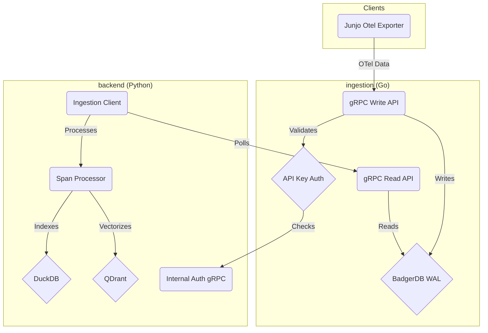
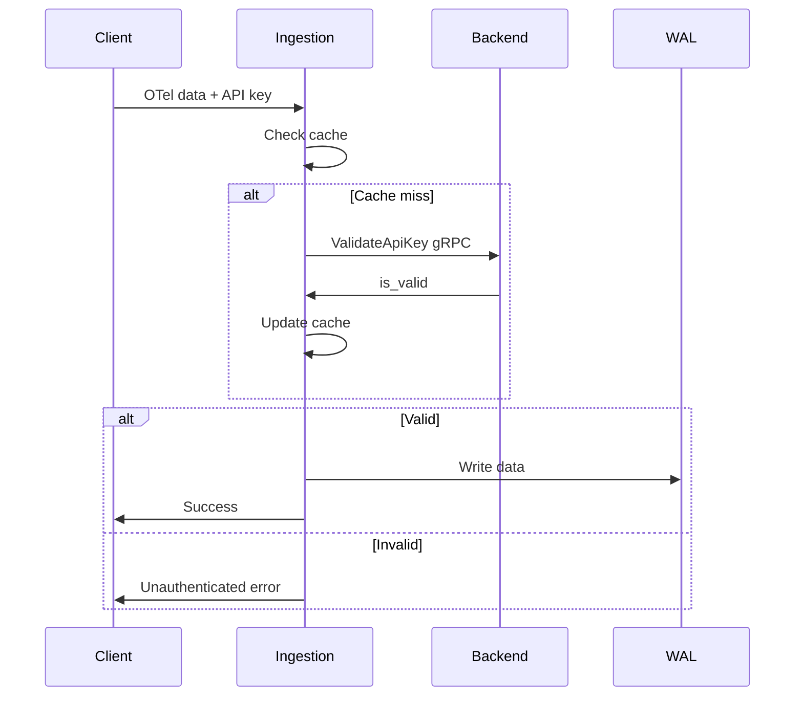

# Junjo AI Studio: Architecture Guide for LLM Agents

> **Document Purpose**: This document describes how Junjo AI Studio works, as a reference for LLMs that will be making changes to the codebase.

## Table of Contents

- [Junjo AI Studio: Architecture Guide for LLM Agents](#junjo-ai-studio-architecture-guide-for-llm-agents)
  - [Table of Contents](#table-of-contents)
  - [1. System Overview](#1-system-overview)
  - [2. Component Architecture](#2-component-architecture)
    - [Backend Service](#backend-service)
    - [Ingestion Service](#ingestion-service)
  - [3. Authentication](#3-authentication)
    - [API Key Auth (OTel Data)](#api-key-auth-otel-data)
    - [Session Cookie Auth (Web UI)](#session-cookie-auth-web-ui)
  - [4. Data Flow: WAL and Indexing](#4-data-flow-wal-and-indexing)
  - [5. OpenInference Conventions](#5-openinference-conventions)
  - [6. Prompt Playground](#6-prompt-playground)
  - [7. Proto Files \& Code Generation](#7-proto-files--code-generation)
  - [8. Code Organization](#8-code-organization)
    - [Core Principles](#core-principles)
    - [Frontend Structure](#frontend-structure)
    - [Backend Structure](#backend-structure)
    - [Database \& Migrations](#database--migrations)
    - [Contract Testing (Frontend/Backend)](#contract-testing-frontendbackend)
  - [9. Configuration](#9-configuration)
  - [Summary](#summary)

---

## 1. System Overview

Junjo AI Studio ingests, stores, and analyzes OpenTelemetry (OTel) data from LLM applications.

**Three components:**
- **`backend`** (Python/FastAPI): User auth, web UI, API, data processing
- **`ingestion`** (Go): High-throughput OTel data receiver with WAL (BadgerDB)
- **Junjo Otel Exporter** (TypeScript): Client library for sending OTel data

**Simple flow:** Client → Ingestion (write to WAL) → Backend (read, index, query)

---

## 2. Component Architecture



### Backend Service

**What it does:**
- Serves web UI and REST API (port 1323)
- Manages users and API keys
- Validates API keys via internal gRPC (port 50053)
- Reads from ingestion WAL, indexes to DuckDB/QDrant

**Key files:**
- `backend/app/main.py` - FastAPI app
- `backend/app/grpc_server.py` - Internal auth gRPC server
- `backend/app/features/internal_auth/grpc_service.py` - ValidateApiKey implementation

**Two servers, one process:**
```python
# FastAPI on port 1323 + gRPC on port 50053
grpc_task = asyncio.create_task(start_grpc_server_background())
```

### Ingestion Service

**What it does:**
- Public gRPC server (port 50051) for OTel data
- Validates API keys (with caching)
- Writes to BadgerDB WAL (fast, append-only)

**Key files:**
- `ingestion/main.go` - Entry point
- `ingestion/server/server.go` - gRPC setup
- `ingestion/server/api_key_interceptor.go` - Auth + caching
- `ingestion/backend_client/auth_client.go` - Backend auth client

---

## 3. Authentication

### API Key Auth (OTel Data)

**Flow:**
1. Client sends OTel data with `x-junjo-api-key` metadata
2. Ingestion interceptor checks cache
3. If not cached, validates with backend internal auth
4. Caches result (5 min TTL)
5. Accepts or rejects request



**Why this design:**
- Ingestion stays fast (cache hits don't touch backend)
- Backend is source of truth for API keys
- Ingestion can run when backend is down (cache continues to work)

### Session Cookie Auth (Web UI)

**Flow:**
1. User signs in via `/auth/sign-in`
2. Backend sets encrypted + signed session cookie
3. Cookie sent with subsequent requests
4. Middleware validates cookie

**Two-layer security:**
```python
# 1. SecureCookiesMiddleware - Encrypts (AES-256)
# 2. SessionMiddleware - Signs (HMAC)
```

**Production requirements:**
- Frontend and backend MUST share same registrable domain
- `SameSite=Strict` requires same-domain for session cookies
- Examples: ✅ `app.example.com` + `api.example.com`, ❌ `app.com` + `api.different.com`

---

## 3.1. Python Backend Internal Authentication gRPC Service

The Python backend (`backend`) now provides an **internal gRPC server** running concurrently with its FastAPI REST API. This gRPC service handles API key validation requests from the `ingestion`.

### Architecture Overview

The Python backend runs **two servers concurrently** in the same process:
1. **FastAPI REST API** on port `1323` (public-facing)
2. **gRPC server** on port `50053` (internal-only)

Both servers share the same SQLite database connection pool and run asynchronously using Python's `asyncio`.

### Concurrent Server Implementation

**Key Files:**
- `backend/app/main.py`: Orchestrates both servers using asyncio lifespan
- `backend/app/grpc_server.py`: gRPC server lifecycle management
- `backend/app/features/internal_auth/grpc_service.py`: InternalAuthService implementation
- `backend/app/database/api_keys/repository.py`: API key database operations

**Startup Flow:**
```python
# main.py - Lifespan context manager
@asynccontextmanager
async def lifespan(app: FastAPI):
    # Startup: Start gRPC server as background task
    grpc_task = asyncio.create_task(start_grpc_server_background())
    yield
    # Shutdown: Stop gRPC server gracefully
    await stop_grpc_server()
```

**Port Configuration:**
- Default gRPC port: `50053` (configured via `GRPC_PORT` environment variable)
- **Security Note**: This port should ONLY be accessible on the internal Docker network in production
- In docker-compose.yml, port 50053 is intentionally NOT exposed to the host

### gRPC Service Implementation

**Proto Definition:**
The service uses the shared `proto/auth.proto` definition:

```protobuf
service InternalAuthService {
  rpc ValidateApiKey(ValidateApiKeyRequest) returns (ValidateApiKeyResponse) {}
}

message ValidateApiKeyRequest {
  string api_key = 1;
}

message ValidateApiKeyResponse {
  bool is_valid = 1;
}
```

**Handler Logic** (`app/features/internal_auth/grpc_service.py`):
```python
class InternalAuthServicer(auth_pb2_grpc.InternalAuthServiceServicer):
    async def ValidateApiKey(
        self,
        request: auth_pb2.ValidateApiKeyRequest,
        context: grpc.aio.ServicerContext,
    ) -> auth_pb2.ValidateApiKeyResponse:
        api_key = request.api_key

        # Query database for API key
        result = await APIKeyRepository.get_by_key(api_key)

        if result is None:
            return auth_pb2.ValidateApiKeyResponse(is_valid=False)

        return auth_pb2.ValidateApiKeyResponse(is_valid=True)
```

**Key Features:**
- **Fail-closed security**: Returns `is_valid=False` on any error (database errors, exceptions)
- **Async database access**: Uses SQLAlchemy async sessions with proper isolation
- **No caching**: Caching is handled by the ingestion service
- **Structured logging**: Logs validation attempts with truncated key prefixes for security

### Database Access Pattern

The gRPC service uses the **high-concurrency async pattern** documented in `backend/app/database/README.md`:

```python
# Each validation creates its own database session
async with db_config.async_session() as session:
    stmt = select(APIKeyTable).where(APIKeyTable.key == key)
    result = await session.execute(stmt)
    db_obj = result.scalar_one_or_none()
```

This pattern ensures:
- Complete isolation between concurrent requests
- No session sharing between gRPC and FastAPI
- Thread-safe operation under high concurrency

### Integration with Ingestion Service

The `ingestion` connects to the Python backend's gRPC service:

**Docker Compose Configuration:**
```yaml
junjo-ai-studio-ingestion:
  environment:
    - BACKEND_GRPC_HOST=junjo-ai-studio-backend
    - BACKEND_GRPC_PORT=50053
  depends_on:
    junjo-ai-studio-backend:
      condition: service_healthy
```

**Connection Flow:**
1. Ingestion service receives OTel data with `x-junjo-api-key` header
2. API key interceptor checks local cache
3. On cache miss, calls Python backend gRPC: `ValidateApiKey(api_key)`
4. Python backend queries SQLite database
5. Returns `is_valid` response
6. Ingestion service updates cache with result

### Testing

**Unit Tests** (`app/features/internal_auth/test_grpc_service.py`):
- Mock APIKeyRepository to test logic without database
- Test valid keys, invalid keys, empty keys, database errors

**Integration Tests** (`app/features/internal_auth/test_grpc_integration.py`):
- Connect to real gRPC server on port 50053
- Test with actual API keys from database
- Verify server connectivity and response format

**Concurrent Access Tests** (`app/features/internal_auth/test_concurrent_access.py`):
- 50+ concurrent gRPC requests
- Mixed FastAPI + gRPC traffic
- Database isolation under load
- Verify no race conditions

## 4. Data Flow: WAL and Indexing

**Why WAL pattern:**
- Decouple fast writes from slow indexing
- Ingestion stays fast even if backend is slow/down
- Backend can catch up at its own pace

**Process:**
1. **Write**: Ingestion writes serialized OTel data to BadgerDB
2. **Read**: Backend polls `WALReaderService` for batches
3. **Track**: Backend stores last processed key in database
4. **Process**: Backend deserializes, indexes to DuckDB/QDrant
5. **Recover**: On restart, backend resumes from last key

**Pull-based = resilient:** Backend pulls data when ready, not pushed.

---

## 5. OpenInference Conventions

**OpenInference** = Standard for LLM telemetry in OTel spans.

**Key attributes used:**
- `llm.provider` - Provider name (e.g., `"openai"`, `"anthropic"`, `"google"`)
- `llm.model_name` - Model ID (e.g., `"gpt-4o"`, `"claude-3-5-sonnet-20241022"`)
- `llm.invocation_parameters` - JSON with request params (temperature, max_tokens, etc.)
- `input.value` - Prompt text
- `output.value` - LLM response

**Provider mapping:**
- OpenInference uses `"google"` for Gemini
- Junjo internally uses `"gemini"`
- Mapping in: `frontend/src/features/prompt-playground/utils/provider-mapping.ts`

---

## 6. Prompt Playground

**Purpose:** Replay and modify LLM requests from captured spans.

**How it works:**
1. User selects span with LLM data
2. Frontend extracts `llm.invocation_parameters`, `input.value`
3. User can modify prompt, model, params
4. Backend proxies request to LLM provider
5. Response streamed back to frontend

**Backend endpoints:**
- `POST /llm/generate` - Generate completion
- `GET /llm/providers/{provider}/models` - List models

**Model lists:**
- OpenAI: Fetched from API
- Anthropic: Hardcoded (models from `litellm.anthropic_models`)
- Gemini: Hardcoded (models from `litellm.gemini_models`)

**Reasoning support:**
- o1/o3 models: `reasoning_effort` parameter
- o3-mini: `reasoning_effort` field in response
- Gemini 2.0: `thinking` content in response

**Frontend architecture:**
```
features/prompt-playground/
  components/
    PromptPlayground.tsx          # Main container
    ModelSelector.tsx             # Model picker
    ParamsPanel.tsx               # Generation settings
    PromptEditor.tsx              # Prompt input
    ResponseViewer.tsx            # Response display
  hooks/
    useLLMGenerate.ts             # API client
  utils/
    span-data-extraction.ts       # Extract from OTel span
    provider-mapping.ts           # Provider name mapping
```

---

## 7. Proto Files & Code Generation

**Shared proto definitions** in `proto/`:
- `auth.proto` - Internal auth service
- `wal.proto` - WAL reader service
- `otel.proto` - OTel span format

**Generation script:** `scripts/generate_proto.sh`

**Python codegen:**
```bash
python -m grpc_tools.protoc \
  --python_out=backend/app/proto_gen \
  --pyi_out=backend/app/proto_gen \
  --grpc_python_out=backend/app/proto_gen \
  -I proto proto/*.proto
```

**Go codegen:**
```bash
protoc \
  --go_out=ingestion/proto_gen \
  --go-grpc_out=ingestion/proto_gen \
  -I proto proto/*.proto
```

**When to regenerate:**
- After modifying `.proto` files
- After pulling changes that modify protos
- Run: `./scripts/generate_proto.sh`

---

## 8. Code Organization

### Core Principles

**Grug brain simple:**
- Small files (< 400 lines)
- One thing per file
- Co-locate related code
- No premature abstraction

**When file is big, ask:**
1. Can I split by feature? (Do it)
2. Can I extract utils? (Do it)
3. Can I split API/business logic? (Do it)
4. Still big? (It's fine, keep going)

**Refactor triggers:**
- File > 400 lines AND has multiple concerns
- Hard to find what you need
- Changes touch many unrelated things
- Test setup is painful

### Frontend Structure

```
frontend/src/
  features/              # Feature-based organization
    prompt-playground/
      components/        # UI components
      hooks/             # React hooks
      utils/             # Pure functions
      types.ts           # TypeScript types
    auth/
    spans/
    api-keys/

  lib/                   # Shared utilities
    api/                 # API client
    datetime-utils.ts
    formatting.ts

  components/            # Shared UI components
    Button.tsx
    Modal.tsx
```

**React patterns:**
- Functional components only
- Hooks for state/side effects
- TypeScript for all code
- Tanstack Query for server state

**File naming:**
- Components: `PascalCase.tsx`
- Hooks: `useCamelCase.ts`
- Utils: `kebab-case.ts`
- Types: `types.ts`

### Backend Structure

```
backend/app/
  features/              # Feature-based organization
    auth/
      router.py          # FastAPI endpoints
      service.py         # Business logic
      schemas.py         # Pydantic models
      test_router.py     # Co-located tests
    api_keys/
    llm_playground/

  database/              # Database layer
    {resource}/
      models.py          # SQLAlchemy models
      repository.py      # Database operations
      schemas.py         # Pydantic schemas

  config/
    settings.py          # Pydantic settings
    deployment_validation.py
```

**Python patterns:**
- Async/await for all I/O
- Pydantic for validation
- FastAPI for HTTP
- gRPC for internal services

**Testing:**
- Co-locate: `test_router.py` next to `router.py`
- Auto-isolation: Database tests get temp DB automatically
- Markers: `@pytest.mark.integration`, `@pytest.mark.unit`

**No test_db parameter needed:**
```python
@pytest.mark.integration
async def test_create_user():
    # Autouse fixture handles database isolation
    async with AsyncClient(...) as client:
        response = await client.post("/users", ...)
```

### Database & Migrations

**Alembic for schema changes:**
- Used for all database schema migrations
- Auto-generates migrations from SQLAlchemy model changes
- Tracks version history in `alembic_version` table

**Critical pattern - Central model registration:**
All SQLAlchemy models MUST be imported in `app/database/models.py`:

```python
# app/database/models.py
from app.database.users.models import UserTable
from app.database.api_keys.models import APIKeyTable
# Import ALL models here
```

**Why this matters:**
- `conftest.py` uses it for `Base.metadata.create_all()` (test databases)
- `alembic/env.py` uses it for autogenerating migrations
- Missing import = Alembic won't detect your model = no migration generated

**Common workflow:**
```bash
# 1. Create/modify model in app/database/{resource}/models.py
# 2. Import it in app/database/models.py
# 3. Generate migration
alembic revision --autogenerate -m "description"
# 4. Review migration file, then apply
alembic upgrade head
```

**High-concurrency pattern:**
- Each operation gets its own session: `async with db_config.async_session() as session:`
- No shared sessions between requests
- Complete isolation for concurrent operations

→ See `backend/app/database/README.md` for complete patterns and pitfalls

### Contract Testing (Frontend/Backend)

**Philosophy:** Backend Pydantic schemas are the single source of truth.

**How it works:**
1. Backend defines response schemas with `Field(examples=[...])`
2. Export OpenAPI schema: `python scripts/export_openapi_schema.py`
3. Frontend generates mocks from OpenAPI using `openapi-backend`
4. Contract tests validate Zod schemas can parse OpenAPI mocks

**Contract test example:**
```typescript
// Validates schema compatibility
const { mock } = generateMock('list_users_users_get')
const result = ListUsersResponseSchema.parse(mock)  // Fails if incompatible
```

**Integration test example (MSW):**
```typescript
// Validates actual request payloads
server.use(
  http.delete('/users/:user_id', ({ params }) => {
    expect(typeof params.user_id).toBe('string')  // Catches type bugs
    return HttpResponse.json({ message: 'Deleted' })
  })
)
```

**What gets caught:**
- Backend adds required field → Frontend parse fails
- Backend changes type → Frontend parse fails
- Frontend sends wrong type in request → Integration test fails
- Path param type mismatch → Contract test fails

**Testing decision tree:**
- API response structure? → Contract test
- Request payload structure? → Integration test with MSW
- Component behavior? → Component test
- Utility function? → Unit test

→ See `TESTING.md` for complete patterns, MSW setup, and shared fixtures

---

## 9. Configuration

**All settings in AppSettings** (flat structure):
```python
class AppSettings(BaseSettings):
    # Environment
    junjo_env: str = "development"

    # Session security
    secure_cookie_key: str
    session_secret: str

    # Production URLs (required when junjo_env="production")
    prod_frontend_url: str | None = None
    prod_backend_url: str | None = None
    prod_ingestion_url: str | None = None

    # CORS (defaults to ["*"] in development)
    cors_origins: list[str] = ["*"]
```

**Production validation:**
- Enforces same-domain for frontend/backend (uses `tldextract`)
- Auto-derives CORS from `prod_frontend_url` if not set
- Validates URL formats (must start with http:// or https://)

**Key files:**
- `backend/app/config/settings.py` - Settings definition
- `.env.example` - Configuration template
- `frontend/prod-startup.sh` - Frontend runtime config

**Environment variables:**
```bash
# Required always
JUNJO_SECURE_COOKIE_KEY=<base64>
JUNJO_SESSION_SECRET=<base64>

# Required in production
JUNJO_ENV=production
JUNJO_PROD_FRONTEND_URL=https://app.example.com
JUNJO_PROD_BACKEND_URL=https://api.example.com
JUNJO_PROD_INGESTION_URL=https://ingestion.example.com
```

**OTLP endpoint:**
```python
@computed_field
def otlp_endpoint(self) -> str:
    # Production: Use ingestion URL
    if self.prod_ingestion_url:
        return self.prod_ingestion_url

    # Development: localhost
    return "grpc://localhost:50051"
```

**Deployment checklist (production):**
- ✅ Frontend accessible at configured URL
- ✅ Backend accessible at configured URL
- ✅ Ingestion accessible at configured URL
- ✅ Reverse proxy maps ingestion to port 50051
- ✅ SSL certs valid for all domains
- ✅ Frontend + backend share same registrable domain

---

## Summary

**Grug's view of Junjo:**

1. **Client send data** → Ingestion (fast write to WAL)
2. **Backend pull data** → Index to DuckDB/QDrant
3. **User use web UI** → Query spans, replay prompts
4. **All use same proto** → No mismatch between services

**Simple parts:**
- One WAL (BadgerDB)
- One query DB (DuckDB)
- One vector DB (QDrant)
- Two auth methods (API key, session cookie)
- Two servers in backend (FastAPI, gRPC)

**When confused, remember:**
- Ingestion = Write fast
- Backend = Read slow, process careful
- WAL = Buffer between fast and slow
- Tests = Co-located, auto-isolated
- Config = Flat, explicit, validated
